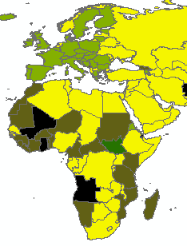

    

        

            <h3 class="text-center">
                Open XX
            </h3>
            [plugin:youtube](https://youtu.be/ptBpbXDczRU)
            

                Aktuell findet ein Paradigmenwechsel zu mehr Offenheit in der Gesellschaft, der Verwaltung, der
                Wirtschaft und auch der Wissenschaft
                statt.
                <a href="#" data-toggle="collapse" data-target="#openxdetails">Details...</a>
                

                    Diese neue Form der Offenheit ist durch Begriffsbildungen mit dem Wort Open geprägt, weshalb wir in
                    diesem Kursteil namens
                    Open XX ausgewählte Facetten solcher Begriffsbildungen betrachten.
                      Ziel der Lerneinheit ist es die wesentlichen Begriffe und Strömungen kennenzulernen und diese
                    einordnen
                    zu können. In der Übung setzen Sie sich intensiver mit Open Access und Open Source Software
                    auseinander.
                

            

        

        

            <h3 class="text-center">Open Data</h3>
            [plugin:youtube](https://youtu.be/PQ-d0F281Uo)
            

                Ein wesentlicher Teil der offenen Bewegung ist die Verfügbarmachung offener Daten.
                <a href="#" data-toggle="collapse" data-target="#oddetails">Details...</a>
                

                    In diesem Kursteil betrachten wir verschiedene Aspekte offener Daten, so z.B. aus dem Bereich der
                    Verwaltung (Open Government
                    Data), der Wissenschaft (Open Science) oder der Zivilgesellschaft (OpenStreetMap oder Citizen
                    Science).
                      Ziel der Lerneinheit ist es offene Daten und deren Nutzbarkeit einschätzen zu können. In der
                    Übung betrachten
                    und vergleichen Sie offene Datenportale und lernen wie offene Daten aufbereitet und einer Nutzung,
                    zumeist
                    in einem Geo-Informationssystem (GIS) zugeführt werden.
                

            

        

    

    

        

            <h3 class="text-center">GIS</h3>
            
 

            

                Geo-Informationssysteme (GIS) sind die Werkzeuge zur Verarbeitung der offenen Geodaten in OpenGeoEdu.
                <a href="#" data-toggle="collapse" data-target="#gisdetails">Details...</a>
                

                    Dieser Kursteil stellt die wesentlichen Grundbegriffe und die Prozessierungskette in GIS vor.
                      Mit kleinen Fallbeispielen werden verschiedene Schritte der GIS-Verarbeitungskette
                    verdeutlicht, die
                    in den sonstigen Kursteilen ebenfalls genutzt werden. Dieser Kursteil ist besonders Nutzern
                    nahezulegen,
                    die noch nicht über genügend theoretisches Fundament und praktische Fertigkeiten zu GIS verfügen.
                

            

        

        

            <h3 class="text-center">Tutorials</h3>
            
 

            

                Tutorials stehen zu verschiedenen Themen bereit. Diese umfassen sowohl eher grundlegende Ausführungen
                als auch praktische
                Anleitungen zum Arbeiten mit GIS.
                <a href="#" data-toggle="collapse" data-target="#tutdetails">Details...</a>
                

                    Somit werden zentrale Aspekte und Vorgehensweise, die in vielen unserer Fallbeispiele benötigt
                    werden, an dieser Stelle nur
                    einmal präsentiert.
                      Mit kleinen Übungsaufgaben werden verschiedene Schritte der GIS-Verarbeitungskette (so z.B.
                    das Erstellen
                    einer thematischen Karte als Visualisierungsform der Ergebnisse räumlicher Analysen) durchlaufen.
                    Dieser
                    Kursteil ist besonders Nutzern nahezulegen, die ausgewählte Aspekte schnell nachlesen oder
                    praktisch
                    bearbeiten wollen.
                

            

        

    

    

        

            <h3 class="text-center">
                Elektromobilität
            </h3>
            [plugin:youtube](https://youtu.be/rEB3Oti20CI)
            

                Der Elektromobilität wird in Deutschland für die Verwirklichung der energie- und klimapolitischen Ziele
                eine wichtige Rolle
                beigemessen.
                <a href="#" data-toggle="collapse" data-target="#emobdetails">Details...</a>
                

                    Jedoch kommt der Ausbau der Elektromobilität in Deutschland nur langsam voran. In diesem Kursteil
                    wollen wir uns mit ausgewählten
                    räumlichen Aspekten der Elektromobilität beschäftigen.
                      Ziel der Lerneinheit ist es die öffentliche Ladeinfrastruktur zu analysieren und mit
                    verschiedenen räumlichen
                    Kriterien wie Reichweiten oder Käuferpotenzialen von E-Fahrzeugen zu kombinieren. So schauen wir
                    uns
                    in der Übung die Verteilung der Ladestationen und deren Erreichbarkeiten auf unterschiedlichen
                    Skalenebenen
                    an.
                

            

        

        

            <h3 class="text-center">
                Biomassepotenziale
            </h3>
            

                <iframe class="embed-responsive-item" src="https://slides.com/al-z/deck/embed" scrolling="no"
                    frameborder="0" webkitallowfullscreen mozallowfullscreen allowfullscreen></iframe>
            

            

                Die Nutzung fossiler Brennstoffe kann durch den effizienten Einsatz von biogenen Ressourcen nachhaltig
                reduziert werden.
                <a href="#" data-toggle="collapse" data-target="#biomdetails">Details...</a>
                

                    Ein besonderer Fokus liegt dabei auf der Verwendung von Nebenprodukten aus der Land- und
                    Forstwirtschaft, Siedlungsabfällen,
                    industriellen Abfällen und Reststoffen von sonstigen Flächen.
                     In diesem Kursteil sollen Sie sich mit der Relevanz, den Arten von Biomasse im Energiesystem
                    und deren
                    räumlichen Verteilung befassen und mittels GIS-Analysen vorhandene Biomassepotenziale abschätzen
                    lernen.
                

            

        

    

    

        

            <h3 class="text-center">
                Flächenmonitoring
            </h3>
            

                <iframe class="responsive-item" src="https://slides.com/opengeoedu/teaser-flaechenmonitoring/embed?style=light"
                    width="576" height="420" scrolling="no" frameborder="0" webkitallowfullscreen mozallowfullscreen
                    allowfullscreen>
                </iframe>
            

            

                Eine nachhaltige Siedlungsentwicklung, d.h. geringer Flächenverbrauch, Begrünung der Städte, Vermeidung
                von Zersiedelung
                durch Innen- vor Außenentwicklung usw.,
                <a href="#" data-toggle="collapse" data-target="#monidetails">Details...</a>
                

                    benötigt als elementare Grundlage hochgenaue, kleinräumige Informationen zur Flächennutzung, zu
                    Gebäuden sowie zur Verkehrsinfrastruktur.
                      In diesem Kursteil sollen Sie quantitative Beschreibungen, Daten- und Analysegrundlagen für
                    eine gute
                    Stadt- und Raumplanung kennenlernen und in praktischen Beispielen, Aufgaben und Übungen auf
                    verschiedenen
                    Skalenebenen arbeiten.
                

            

        

        

            <h3 class="text-center">
                Fernerkundung
            </h3>
            

                <iframe class="embed-responsive-item" src="https://slides.com/opengeoedu/deck-2/embed?style=light"
                    width="576" height="420" scrolling="no" frameborder="0" webkitallowfullscreen mozallowfullscreen
                    allowfullscreen></iframe>
            

            

                Die Erkundung der Erde aus der Luft, sei dies vom Satelliten bis zu Flugdrohnen, nimmt aktuell Fahrt
                auf.
                <a href="#" data-toggle="collapse" data-target="#geovisdetails">Details...</a>
                

                    Insbesondere mit der Nutzung operationeller und kostenfreier Dienste aus dem europäischen
                    Copernicus-Programm ergeben sich
                    vielfältige neue Anwendungsmöglichkeiten.
                      In diesem Kursteil sollen Sie sich mit der Recherche, Aufbereitung - von der einfachen
                    Indexberechnung
                    bis zur komplexeren Klassifikation - und Nutzung von Satellitenbilddaten beschäftigen.
                

            

        

    

