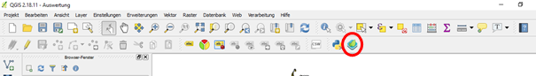

## Aufgabe 1
Öffnen Sie das [ESRI Deutschland Open Data Portal](http://opendata-esri-de.opendata.arcgis.com) im Browser.
Suchen Sie nach „Kreisgrenzen“.
Suchen Sie den Datensatz „Deutschland Kreisgrenzen 2015“ Datensatz heraus.
Klicken Sie auf Daten herunterladen, und wählen Sie als Format „Shapefile“ aus.

## Aufgabe 2
Öffnen Sie die [Overpass-Turbo Webseite](https://overpass-turbo.eu/), um eine Anfrage an die Overpass API von OpenStreetMap zu stellen.
Wählen Sie dazu manuell ungefähr das deutsche Staatsgebiet aus, und stellen Sie folgende Anfrage:

```
[timeout:200];
// gather results
(
  // query part for: “"charging station"”
  node["amenity"="charging_station"]({{bbox}});
);
// print results
out;
```


Wählen Sie dann die Schaltfläche „Export“, und exportieren Sie die Daten in einem Format das in QGIS als Vektordatei geöffnet werden kann, z.B. GeoJSON.

Vollständigere Alternative: OpenChargeMap
API Anfrage: https://api.openchargemap.io/v2/poi/?output=kml&countrycode=DE&opendata=true&maxresults=20690

## Aufgabe 3
Öffnen Sie die Webseite des [Statistischen Bundesamtes](https://www.regionalstatistik.de/).

Suchen Sie nach „Bevölkerungsdichte“, wählen Sie dann bei den Ergebnissen „Merkmale“, und suchen Sie nach einer Statistik zu Bevölkerungsdichte je qkm.
Es sollte eine Tabelle aus dem Regionalatlas Deutschland zu finden sein. Wählen Sie hier das Jahr 2015 als Zeitraum aus, bevor Sie den Werteabruf starten.
Exportieren Sie die nachfolgend angezeigte Tabelle als .xlsx-Datei, mittels des entsprechenden Buttons unter „Optionen“.

Suchen Sie dann nach „Durchschnittsalter“, wählen Sie wieder „Merkmale“, und suchen Sie einen Datensatz der ebenso aus 2015 stammt.
Exportieren Sie die Daten dann wieder als .xlsx.

Suchen Sie dann nach „Einkommen“, wählen Sie „Merkmale“ und suchen Sie nach einem Datensatz zum Verfügbaren Einkommen je Einwohner auf Kreisebene.
Dieser sollte mindestens für das Jahr 2014 verfügbar sein.

## Aufgabe 4
Öffnen Sie [draw.io](https://www.draw.io/) und erstellen sie ein neues Diagramm.
Wählen sie als Grundlage „Blank Diagram“.


Für die in den vorherigen Aufgaben gesammelten Daten soll nun eine Datenstruktur entwickelt werden, um diese systematischer bearbeiten zu können.
Hierfür benötigen wir die Diagrammelemente unter „UML“.

Genauer gesagt soll ein Klassendiagramm erstellt werden, in dem es für die Klassen genügt die Attribute anzugeben, da in statischen Daten wie diesen keine Methoden vorkommen. In draw.io nennt sich dieses Element „Class 2“.

Erstellen Sie eine Klasse für alle 5 Datensätze, außerdem eine weitere Klasse für die Kombination aller Zensusdaten. Verbinden Sie die Klassen dann mit den passenden Relationen. Im Falle der Zensusdaten sollten die einzelnen Datensätze mittels „Generalization“ mit der übergreifenden Klasse verbunden werden, alle anderen Klassen untereinander mittels „Association“.

Fügen Sie nun alle für die Auswertungen wichtigen Attribute/Spalten, die Sie in den Attributtabellen der Daten finden, als Felder im Klassendiagramm hinzu. Versuchen Sie dabei die Anzahl an Feldern möglichst weit zu reduzieren.

## Aufgabe 5
Installieren Sie QGIS und öffnen Sie QGIS Desktop. Fügen Sie dann die Kreisgrenzen und die Ladestationen als Vektorlayers hinzu.

Nutzen Sie das „Clip“-Werkzeug (Vektor -> Geoverarbeitungswerkzeuge -> Zuschneiden) mit den Ladestationen als Eingabe, und den Landesgrenzen als Clip-Layer.

Fügen Sie nun die drei Tabellen mit den demographischen dem Projekt hinzu. Rechtsklicken Sie auf die Kreisgrenzen-Shapefile, öffnen Sie die Eigenschaften und wählen Sie den Reiter „Verknüpfungen“.

Dort klicken Sie auf das grüne Plus-Zeichen. Verknüpfen Sie für alle drei Tabellen das erste Feld mit dem Feld „RS“ im Kreisgrenzendatensatz. Wenn Sie nun in die Attributtabelle der Kreisgrenzen schauen, werden Sie sehen, dass alle Spalten der drei demographischen Tabellen an passender Stelle hinzugefügt wurden.

## Aufgabe 6
Nutzen Sie erst das Point-in-Polygon (Vektor -> Analyse-Werkzeuge -> Punkte in Polygon zählen) um die Ladestationen in jedem Landkreis zu zählen. Speichern Sie den neu entstandenen Datensatz.

Um nun Bevölkerungsdichte und Anzahl der Ladestationen zu normalisieren, benötigen wir den Mittelwert (x¯¯¯) und die Standardabweichung (σ) beider Spalten um folgende Formel zu berechnen:

x′=x−x¯¯¯σ

Dafür öffnen wir die Attributtabelle unseres Datensatzes, und starten dann den Feldrechner. Dieser erlaubt es uns neue Spalten Feld für Feld nach bestimmten Formeln mit Werten zu füllen. Wir wählen „Neues Feld anlegen“, überlegen uns einen passenden Namen für das neue normalisierte Attribut und führen folgende Formel aus:
```
("ATTR_NAME" - mean("ATTR_NAME")) / (stdev("ATTR_NAME"))
```
`ATTR_NAME` sollte dabei durch den Namen der entsprechenden Tabellenspalte ersetzt werden. Mean und stdev aggregieren Mittelwert und Standardabweichung über die gesamte Spalte, während `ATTR_NAME` für jedes neue Feld den Wert des Ursprungsfeldes in der gleichen Zeile einsetzt.

Dies muss sowohl für Ladestationen als auch Bevölkerungsdichte durchgeführt werden. Achten Sie dabei auf die Formate der Spalten, evtl. liegen die Zahlen in einer der Spalten als Strings gespeichert vor, und müssen erst mittels `to_real()` oder `to_int()` umgewandelt werden.

Sobald diese beiden Attribute berechnet sind, kann die Nachfrage geschätzt werden. Wir werden hier einfach die Differenz nutzen. Nutzen Sie wieder den Feldrechner und subtrahieren Sie die Spalte der standardisierten Ladestationenzahl von der Spalte mit der standardisierten Bevölkerungsdichte.

Öffnen Sie dann die Eigenschaften, klicken auf den Reiter „Stil“ und wählen im obersten Drop-Down Menü „Abgestuft“. Suchen Sie einen Farbverlauf Ihrer Wahl aus und klicken Sie dann auf „Klassifizieren“. Stellen Sie sicher dass die vom Programm gewählten Grenzen sinnvoll sind und für eine aussagekräftige Einfärbung der Karte sorgen. Experimentieren Sie mit verschiedenen Modi und Farbverläufen.

Öffnen Sie das gleiche Menü bei den Ladestationen, und justieren Sie Farbe und Größe so dass diese sichtbar sind, aber nicht die berechneten Ergebnisse überdecken.

Sollte die Karte verzerrt wirken, klicken Sie auf den Projektionsnamen in der unteren rechten Ecke des Fensters und aktivieren Sie Spontanreprojektion. Dann suchen Sie nach „ETRS89 / UTM zone 32N“ un wenden diese auf die Karte an.

Nun muss eine druckbare Karte als PDF erstellt werden. Klicken Sie die Schaltfläche „Neue Druckzusammenstellung“, direkt neben dem „Speichern als“-Knopf. Nachdem Sie einen Namen vergeben haben öffnet sich das Fenster zur Erstellung einer Karte.

Hier müssen sie zuerst „Neue Karte hinzufügen“ anklicken, das Kartenelement an die richtige Stelle platzieren und dann mittels „Eintrag wählen/verschieben“ und „Den Elementinhalt verschieben“ die Karte richtig positionieren. Auf der rechten Seite gibt es die Reiter „Zusammenstellung“ und „Elementeigenschaften“, hier können Sie Layout, Maßstab und Ähnliches einstellen.

Ist die Karte ansprechend positioniert, fügen Sie die restlichen Elemente die für eine Karte wichtig sind hinzu (Legende, Maßstab etc.). Diese finden Sie alle im Menü auf der linken Seite.

Dieser Schritt ist relativ komplex, Sie können daher das nachfolgende Video als Anleitung benutzen. Beachten Sie dass dies nur eine kurze Demonstration ohne besonderen Fokus auf ansprechendes Layout ist. Experimentieren sie mit den Einstellungen und Elementpositionen, um ein kartographisch ansprechendes und professionell wirkendes Resultat zu erhalten.

[plugin:youtube](https://www.youtube.com/watch?v=EMAT-hqmlXI)
(Auf Youtube ansehen)[https://www.youtube.com/watch?v=EMAT-hqmlXI]

Bei weiteren Fragen gibt es auch noch die offizielle Anleitung:
[http://docs.qgis.org/2.6/de/docs/user_manual/print_composer/print_composer.html](http://docs.qgis.org/2.6/de/docs/user_manual/print_composer/print_composer.html)

## Aufgabe 7
Die in der vorherigen Aufgabe getätigten Schritte treten leicht abgewandelt bei vielen Auswertungen auf. Nutzen Sie was sie gelernt haben.

## Aufgabe 8
Klicken Sie auf „Erweiterungen“ und suchen Sie nach Qgis2web. Installieren Sie diese Erweiterung. In der Werkzeugleiste sollte nun ein neues Symbol mit dem Label „Create Web Map“ aufgetaucht sein.

Öffnen Sie dieses. Zuerst öffnet sich eine Seite mit Export-Einstellungen. Gehen Sie sicher dass die richtigen Layer angewählt sind (Ladestationen und Kreisgrenzen mit Nachfrageschätzung für die Pflichtauswertung).

Wählen Sie in der Liste unten links unter „Data Export“ -> „Exporter“ -> „…“ einen Ordner aus, in den die Webseiten-Dateien geschrieben werden sollen. Wählen Sie dann unten rechts die Hintergrundkarte für Ihre Daten aus, am besten „OSM“. Dann klicken Sie auf „Export“.

Im vorher ausgewählten Ordner sollte nun ein weiterer Ordner mit den Daten der Webseite zu finden sein. Öffnen Sie „index.html“ um die Webkarte zu betrachten.

Führen Sie diesen Prozess für die beiden Auswertungen durch. Enthält Ihre Auswertung mehrere Karten-Layer, dann nutzen Sie den mitgelieferten Layer-Switcher, welcher in der oberen rechte Ecke der Karte zu finden ist und es erlaubt dynamisch Layer hinzuzufügen und abzuschalten.

Überlegen Sie sich dann wie Sie ihre Ergebnisse möglichst sinnvoll präsentieren können. Sie könnten beispielsweise die Karten in einen kleineren Seitenausschnitt komprimieren, und eine Titelleiste und Erklärungstext hinzufügen. Versuchen sie dabei gängige Web-Elemente zu benutzen, um die Seite nutzerfreundlich zu gestalten. Das Bootstrap-Framework bietet dafür z.B. einige einfache Starter-Templates, aus denen Sie sich bedienen können.
(https://v4-alpha.getbootstrap.com/examples/)

Die Karte befindet sich im HTML-Body in einem <div> Element, welches von Skripten und durch CSS befüllt wird. Bauen Sie um dieses herum Ihre HTML-Seite auf. Sie müssen kein Javascript oder CSS benutzen, besonders letzteres wird meistens gut von Bootstrap übernommen. Eine grundlegende Einführung in HTML finden Sie in den externen Materialien, benötigen Sie weitergehende Funktionalität gibt es eine große Menge einsteigerfreundlicher Ressourcen.
