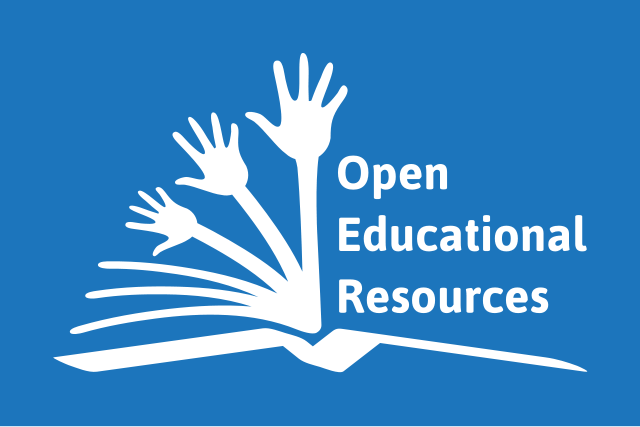
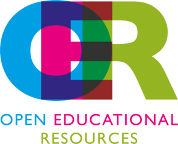

[center]
**Das OER Global Logo von 2012 Jonathas Mello [www.jonathasmello.com](http://www.jonathasmello.com/)
steht unter der Lizenz Creative Commons Attribution 3.0 Unported ([CC BY 3.0](http://creativecommons.org/licenses/by/3.0))
 via [UNESCO](http://www.unesco.org/new/en/communication-and-information/access-to-knowledge/open-educational-resources/global-oer-logo/)**
[/center]

Offene Bildungsinhalte ist im engeren Sinne die deutsche Übersetzung von Open Educational Resources (OER) und bedeutet im weiteren Sinne, dass Bildungsinhalte offen in einem doppelten Sinne sind: Sie sind frei zugänglich und dürfen frei verwendet werden. Weitere konkurrierende Begriffe sind Freie Lern- und Lehrressourcen und dergleichen.

Offene Bildungsinhalte sind somit freie Inhalte, die für den Bildungsbereich erstellt werden bzw. wurden oder dafür geeignet sind.

[center]
**[Markus Büsges (leomaria design) für Wikimedia Deutschland e.V.](https://commons.wikimedia.org/wiki/File:OER_Logo_Open_Educational_Resources.png), Lizenz: [CC BY-SA 4.0](https://creativecommons.org/licenses/by-sa/4.0/deed.en)**
[/center]

!!! Weitferführende Informationen
!!! * [UNESCO - OER](http://www.unesco.org/new/en/communication-and-information/access-to-knowledge/open-educational-resources/)
!!! * [ZUM-Wiki | Zentrale für Unterrichtsmedien im Internet e.V.](http://wikis.zum.de/zum/Open_Educational_Resources)
!!! * [Diskussion zu den OER Logos](https://open-educational-resources.de/offizielles-oer-logo/)
