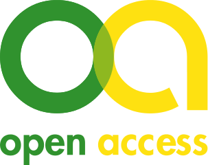

Open Access (OA) bezeichnet den unbeschränkten und kostenlosen Zugang zu wissenschaftlicher Information weltweit. OA kann als Gegenmodell eines verlagskontrollierten Zugangs zu wissenschaftlichen Publikationen gesehen werden, bei dem nur derjenige den Zugang zu wissenschaftlichen Werken erhält, der sich die Anschaffungskosten von Zeitschriften und Büchern leisten kann. In der Wissenschaft wird dieses seit Anfang des Jahrhunderts intensivierte OA-Prinzip inzwischen nachhaltig gefordert und unterstützt. Umfangreiche Informationen zu OA werden durch das Open-Access-Netzwerk unter www.open-access.net bereitgestellt.

Das Konzept „Open Access“ will den Zugang zu wissenschaftlichen Erkenntnissen erleichtern und Forschungsergebnisse besser sichtbar machen. Wissenschaftliche Informationen, die im Rahmen der öffentlich geförderten Forschung entstehen, sollen über das Internet für jeden Nutzer ohne finanzielle, technische oder rechtliche Barrieren zugänglich und nachnutzbar sein. Bei Open Access geht es nicht nur um den Zugang zu qualitätsgesicherten Textpublikationen, sondern auch zu anderen digitalen Objekten wie zum Beispiel Forschungsprimärdaten oder Monographien.

!! Schauen Sie sich hierzu einmal folgendes [Video](https://www.youtube.com/watch?v=PZhMtUvypbI) an.   Sollte das Video nicht mehr verfügbar sein, suchen Sie nach Alternativen.

[")](https://www.youtube.com/watch?v=PZhMtUvypbI)

!! OA und creativecommons - Typen kurz erklärt: https://youtu.be/gzRgknylTEM
