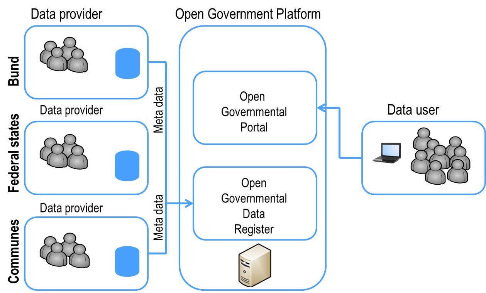
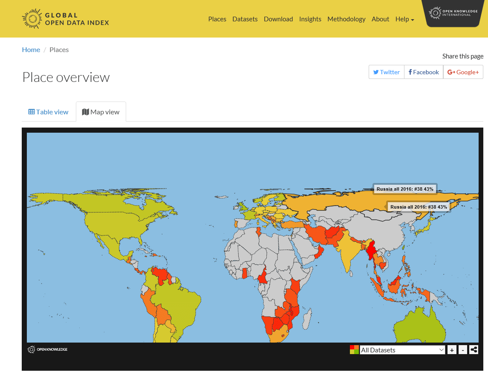

[ui-accordion independent=true open=none][ui-accordion-item title="Politisches Statement"]
> In der [Dresdner Vereinbarung](http://www.de.digital/DIGITAL/Redaktion/DE/IT-Gipfel/Publikation/2010/it-gipfel-2010-dresdner-vereinbarung.pdf?__blob=publicationFile&v=4) zum 5. Nationalen IT-Gipfel im Dezember 2010 hat die Politik sich dazu bekannt, bis 2013 den Aufbau einer zentral zugänglichen, den Interessen der Nutzer an einem einheitlichen, leichten und benutzerfreundlichen Zugriff gerecht werdenden Open-Government Plattform mit dem Schwerpunkt auf der Bereitstellung offener Verwaltungsdaten voranzutreiben. Diese soll bestehende Datenplattformen von Bund, Ländern und Kommunen vernetzen, weitere Datenplattformen unterstützen und den Anforderungen von Bund, Ländern und Kommunen sowie den fachlichen Qualitätserwartungen der Nutzer gerecht werden. Damit soll der Zugang zu Daten und Informationen der Verwaltung verbessert werden und der weitere Ausbau eines medienbruchfreien und prozessorientierten E-Governments unterstützt werden (BMI, 2012). Auch der 3. Geo-Fortschrittsbericht der Bundesregierung erwähnt explizit die Koexistenz von Open Data zu national aufgebauten Geodateninfrastrukturen. <cite>[Bundesregierung 2012](http://www.de.digital/DIGITAL/Redaktion/DE/IT-Gipfel/Publikation/2010/it-gipfel-2010-dresdner-vereinbarung.pdf?__blob=publicationFile&v=4)</cite>

[/ui-accordion-item]

[ui-accordion-item title="Vernetzungsidee über die Verwaltungsebenen hinweg"]
Offene Verwaltungsdaten sind solche Daten des öffentlichen Sektors, welche im öffentlichen Interesse nachnutzbar, verteilbar und neue Nutzungen ermöglichend ohne Einschränkungen frei verfügbar gemacht werden. Es handelt sich also um Daten der Verwaltung, die keinen rechtlichen Einschränkungen (Personenschutz, Datenschutz, Geheimhaltung u.a.) und offenen Lizenzen unterliegen, maschinenlesbar und ohne Kosten bereitgestellt werden können.

[center]
**Open Government Studie (2012), S. 80**
[/center]
[/ui-accordion-item]

[ui-accordion-item title="Rechtsrahmen und vergleichende Gegenüberstellung"]
Dies ist auch im Rechtsraum durch z.B. die Public Sector Information (PSI) Directive auf europäischer Ebene, das E-Government-Gesetz ([EGovG](https://de.wikipedia.org/wiki/E-Government-Gesetz_(Deutschland)) oder das Geodatenzugangsgesetz ([GeoZG](https://de.wikipedia.org/wiki/Geodatenzugangsgesetz)) auf nationaler Ebene abgesichert.
Der [Global Open Data Index](https://index.okfn.org/) stellt ein jährliches Ranking der Länder anhand von zehn Schlüsseldatensätzen an jedem Ort zusammen, ausgeführt von lokalen Open Data Experten:

1. Wahlergebnisse
1. Unternehmensregister
1. Landeskarte
1. Staatsausgaben
1. Staatsbudget
1. Gesetzgebung
1. Nationale Statistiken
1. Postleitzahlen
1. Fahrpläne
1. Schadstoffemissionen

**Global Open Data Index**

Im August 2017 wurden 94 Länder mit 1410 Einträgen gelistet, von denen 166 frei verfügbar waren. Deutschland liegt im Ranking auf Platz 24. Führend sind Taiwan, Australien und Groß-Britannien.

! Weiterführende Informationen unter:
! * [Public Sector Information (PSI) Directive](https://ec.europa.eu/info/consultations/public-consultation-review-directive-re-use-public-sector-information-psi-directive_de)
! * [E-Government-Gesetz (EGovG)](http://www.gesetze-im-internet.de/egovg/)
! * [Geodatenzugangsgesetz (GeoZG)](https://www.gesetze-im-internet.de/geozg/BJNR027800009.html)
! * [Global Open Data Index](https://index.okfn.org/)

!! * Schauen Sie sich im Global Open Data Index die Bewertung von Deutschland im Vergleich zu einem Land an der Spitze des Rankings an.
!! * Betrachten Sie die Bewertung von Deutschland und vergleichen Sie dies mit Ihren persönlichen Erfahrungswerten zur Daten- und Informationspolitik.
[/ui-accordion-item]

[ui-accordion-item title="Beispiele offener Verwaltungsdaten, im Maßstab: EU bis zur Kommune"]
Auf den unterschiedlichsten administrativen Ebene von der EU bis zur Kommune finden sich zahlreiche Angebote offener Verwaltungsdaten, meist geordnet nach Rubriken wie
* Geographie, Geologie und Geobasisdaten
* Infrastruktur, Bauen und Wohnen
* Wirtschaft und Arbeit
* Bildung und Wissenschaft
* Umwelt und Klima
* Bevölkerung
* Soziales
* Transport und Verkehr
* Verbraucherschutz
* Öffentliche Verwaltung, Haushalt und Steuern
* Gesundheit
* Politik und Wahlen
* Kultur, Freizeit, Sport und Tourismus
* Gesetze und Justiz

Daten zum Download werden in den unterschiedlichsten Formaten angeboten. Die Abbildung zeigt die Formate in OpenGovData (Stand 28.9.2017, 20693 Treffer, 42761 Dokumente aufgrund von Mehrfachformatangeboten).

Eine kleine Auswahl von Portalen findet sich hier. Eine umfassende Einstiegsseite bietet das Portal der Open Data Portale in Open GeoEdu.

| [**Europäische Union**](https://www.europeandataportal.eu/)| [**GovData Portal für Deutschland**](https://www.govdata.de/) | [**OpenData.HRO Hansestadt Rostock**](https://www.opendata-hro.de/) |
| :-- | :-- | :-- |
|  |  | 

!! * Suchen Sie sich ein Open Data Portal aus und schauen Sie sich die darin enthaltenen Datenangebote an.
[/ui-accordion-item]
[/ui-accordion]
[Hier geht es zur Open Data Portale Karte](http://portal.opengeoedu.de/)
