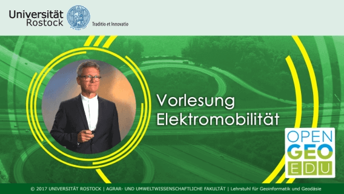
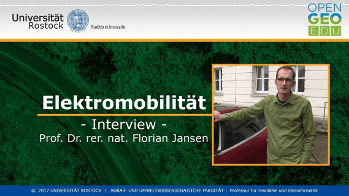

---
taxonomy:
    category:
        - docs
menu: Elektromobilität
---

### OpenGeoEdu Fallbeispiel

# Elektromobilität

Videos zum Fallbeispiel **Elektromobilität**
[owl-carousel items=3 loop=true autoplay=true autoplayHoverPause=true responsive={0:{items:1},1000:{items:2},1400:{items:3}}]

[/owl-carousel]
