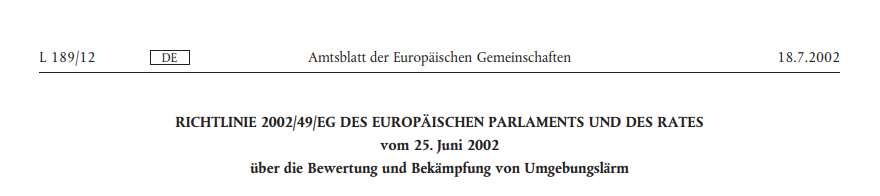

Einleitend zu dieser Frage hier eine Definition im Sinne der "Richtlinie des Europäischen Parlaments und des Rates über die Bewertung und die Bekämpfung von Umgebungslärm":

!!! Unter „Umgebungslärm“ werden, durch menschliche Aktivitäten induzierte, **belästigende** oder **gesundheitsschädliche Geräusche im Freien** subsummiert. Explizit handelt es sich hierbei um Schallemissionen von Verkehrsmitteln, also Lärm, ausgehend vom **Straßen-, Schienen-** und **Flugverkehr** sowie Lärm, der von **Industrie–** und **Gewerbeanlagen** ausgeht.  

[center][fa=car extras=fa-4x /] + [fa=train extras=fa-4x /] + [fa=plane extras=fa-4x /] + [fa=industry extras=fa-4x][/center]

Kein Umgebungslärm hingegen ist **Nachbarschaftslärm** (private Feste, Musik, Singen etc.), der **Lärm am Arbeitsplatz** und **in Verkehrsmitteln.**

! Die ganze [RICHTLINIE 2002/49/EG DES EUROPÄISCHEN PARLAMENTS UND DES RATES vom 25. Juni 2002 über die Bewertung und Bekämpfung von Umgebungslärm (Deutscher Text)](https://eur-lex.europa.eu/legal-content/DE/TXT/PDF/?uri=CELEX%3A32002L0049&from=DE) zum Nachlesen.
