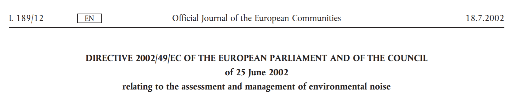

As an introduction to this question, here is a definition in the sense of the "Directive of the European Parliament and of the Council relating to the assessment and management of environmental noise":

!!! Environmental noise refers to noise in the open air **induced by human activities**, which is **annoying** or **harmful to health**. These are explicitly noise emissions from means of transport, i.e. noise from **road**, **rail** and **air traffic** and **noise from industrial and commercial installations**.

[center][fa=car extras=fa-4x /] + [fa=train extras=fa-4x /] + [fa=plane extras=fa-4x /] + [fa=industry extras=fa-4x][/center]

No ambient noise, on the other hand, is **neighbourhood noise** (private parties, music, singing, etc.), **noise at the workplace** and ***in* means of transport**.

! Read the whole [Directive 2002/49/EC of the European Parliament and of the Council of 25 June 2002 relating to the assessment and management of environmental noise (English)](https://eur-lex.europa.eu/legal-content/EN/TXT/PDF/?uri=CELEX:32002L0049&from=EN).
