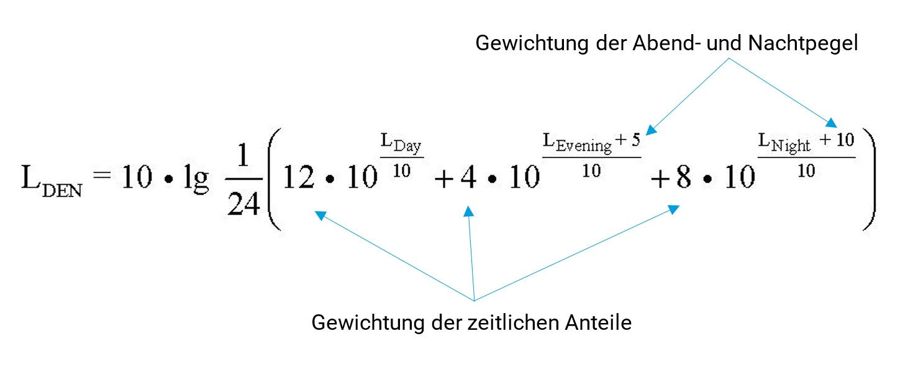

## VBUS
Mit der Vorläufigen Berechnungsmethode für den Umgebungslärm an Straßen (VBUS) können die Lärmindizes, die für die Lärmkartierung erforderlich sind, berechnet werden.
Für jeden Zeitraum wird ein [Dauerschallpegel](http://www.umweltbundesamt.at/umweltschutz/laerm/schalldruckpegel) berechnet. 
Zusätzlich wird ein gewichteter 24-Stundenwert, der Tag-Abend-Nacht-Lärmindex LDEN ermittelt.
Für die Abend- und Nachtzeiten werden Zuschläge berücksichtigt; dem Abendindex werden 5 dB(A) und dem Nachtindex 10 dB(A) hinzuaddiert(s. Abb.)

## CNOSSOS – Europäische Berechnungsmethode für den Umgebungslärm
Nach einigen (vorläufigen) nationalen Alleingängen und Übergangsvorschriften, s. VBUS, wurde mit der 

„Richtlinie (EU) 2015/996 der Kommission vom 19. Mai 2015 zur Festlegung gemeinsamer Lärmbewertungsmethoden gemäß der Richtlinie 2002/49/EG des Europäischen Parlamentes und des Rates mit Änderungen vom 10. Januar 2018“ 

eine europaweit gemeinsame einheitliche Bewertungsmethode festgelegt. Diese muss ab 2019 verbindlich bei der Lärmkartierung angewendet werden.

! Text der RL http://eur-lex.europa.eu/legal-content/DE/TXT/?uri=CELEX:32015L0996

Die RL sowie das Bewertungsmodell sind Gegenstand eines intensiven wissenschaftlichen Diskurses (Vgl. https://www.researchgate.net/search.Search.html?type=publication&query=cnossos-eu)

! Bundesamt für Straßenwesen mit Bewertungen zu dem Model https://www.bast.de/BASt_2017/DE/Verkehrstechnik/Fachthemen/cnossos.html  
! https://ec.europa.eu/jrc/en/publication/reference-reports/common-noise-assessment-methods-europe-cnossos-eu 

