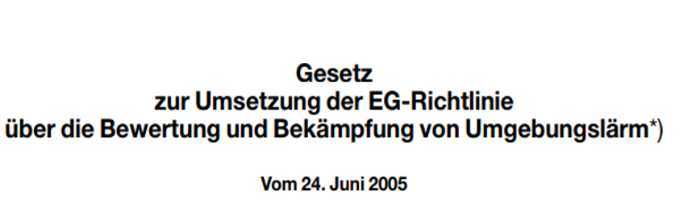
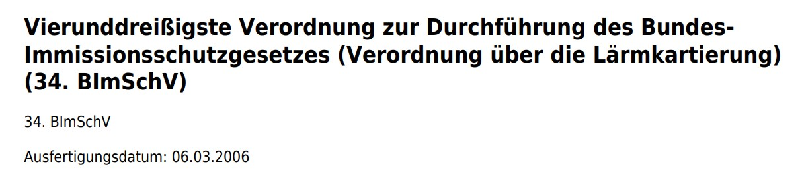

## Commission report on the EU Environmental Noise Directive

According to the END, the European Commission draws up a report on its implementation every five years. This report takes into account the first two reporting rounds and makes recommendations for future reporting rounds. Here, too, we recommend a brief look at the extensive material.

! [Commission report on the EU Environmental Noise Directive (2017)](https://eur-lex.europa.eu/legal-content/EN/TXT/PDF/?uri=CELEX:52017DC0151)

## Implementation of the END in Germany

The Environmental Noise Directive was amended in Germany by the Federal Immission Control Act ([Bundes-Immissionsschutzgesetz - BImSchG](http://www.gesetze-im-internet.de/bimschg/index.html)) of 24 June 2005. 

and the subsequent enactment of the thirty-fourth ordinance implementing the Federal Immission Control Act ([Verordnung über die Lärmkartierung - Ordinance on Noise Mapping](http://www.gesetze-im-internet.de/bimschv_34/index.html)) 

of 06 March 2006 into German law.

!! These texts regulate terms, contents and requirements for noise mapping and the noise action plan, i.e. the implementation of the Environmental Noise Directive in Germany. Try to comprehend this... or look up terms in the fully translated [Noise Manual for Urban Development](https://www.staedtebauliche-laermfibel.de/?p=0)

<!-- 

## Umsetzung der RL in AT

## Umsetzung der RL in CH -->