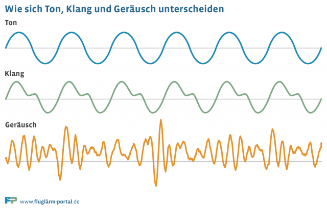

<a href="https://www.flickr.com/people/37996646802@N01">cogdogblog</a>, <a href="https://commons.wikimedia.org/wiki/File:2012-366-25_Drop_a_Needle_(6763970597).jpg">2012-366-25 Drop a Needle (6763970597)</a>, <a href="https://creativecommons.org/licenses/by/2.0/legalcode" rel="license">CC BY 2.0</a>

Definitionen zum Geräusch
1.	im physikalischen Sinne eine Schallform, deren Frequenzspektrum – im Unterschied zu Tönen und Klängen – kontinuierlich ist oder Frequenzen aufweist, die nicht im Verhältnis kleiner ganzer Zahlen zueinanderstehen. 

2.	im Sinne technischer und juristischer Normen jedes unbeabsichtigte Schallereignis, im Unterschied zum Lärm, der als unangenehmes Schallereignis aufgefasst wird.
Verschiedene Geräusche, z.B. ein Knall, können ganz charakteristische Spektren haben, was die physikalische Grundlage für einschlägige Begriffsbildungen der Alltagssprache ist (Blubbern, Knacken, Knirschen, Knistern, Prasseln, Rauschen, Zischen).  <cite><a href="https://www.spektrum.de/lexikon/physik/geraeusch/5764">LEXIKON DER PHYSIK - Spektrum.de</a></cite>

<a href="https://commons.wikimedia.org/wiki/User:Kdkeller">Klaus-Dieter Keller</a>, <a href="https://commons.wikimedia.org/wiki/File:Oszi_Geräusch.svg">Oszi Geräusch</a>, <a href="https://creativecommons.org/licenses/by-sa/3.0/legalcode" rel="license">CC BY-SA 3.0</a>

## [Was unterscheidet Ton, Klang und Geräusch?](http://www.laermorama.ch/m1_akustik/tonklang_w.html)

! Hands on!:
! * [Virtuelles Oszilloskop](https://www.bildungsserver.de/onlineressource.html?onlineressourcen_id=16715) (Adobe Shockwave Plugin erforderlich)
! * [Oszilloskop: Online-Simulation](https://www.oszilloskope.net/oszilloskop/) (Javascript)

! Diverse (vom Aussterben bedrohte) Geräusche sind hier konserviert https://www.conservethesound.de/ hier auch http://savethesounds.info/ <i class="far fa-smile"></i>
