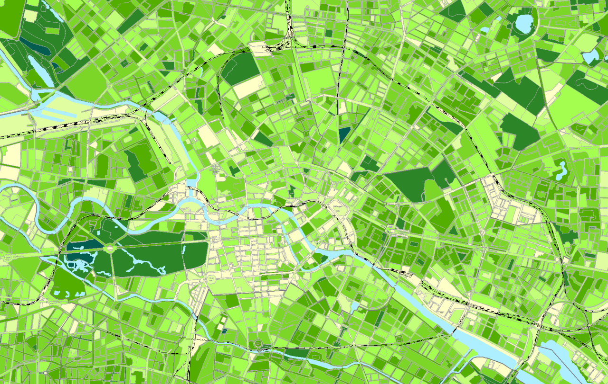
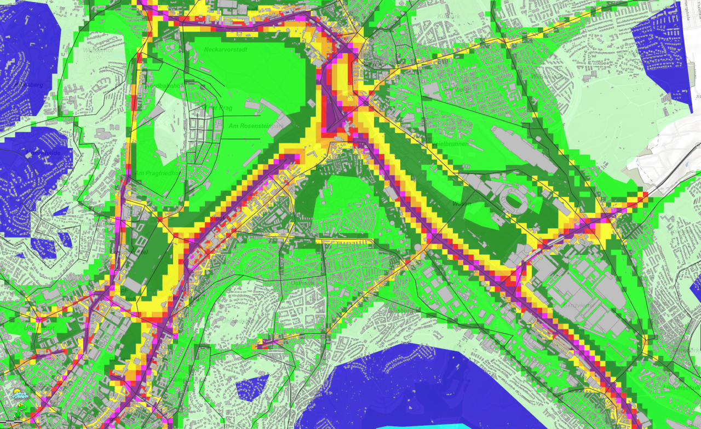
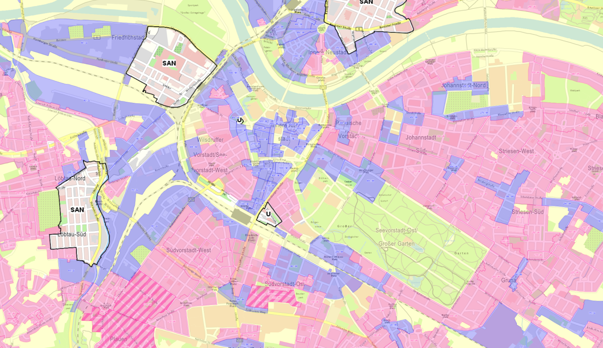
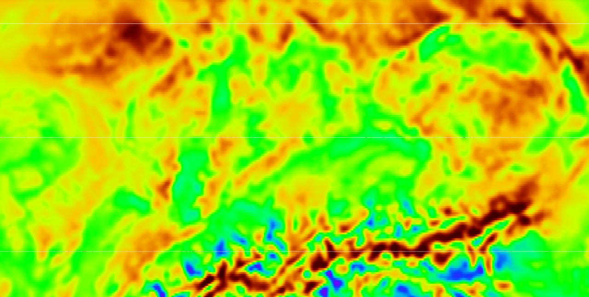
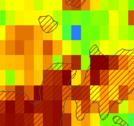

Der Bedarf an **kleinräumigen Informationen ist vielfältig**. Damit können **Wissenschaft und Praxis Maßnahmen und Entscheidungen optimieren**, aber auch die bisherigen Erfolge oder Fehler genauer identifizieren. Hier sollen insbesondere die Anforderungen an die Daten betrachtet werden – z. B. räumliche und zeitliche Auflösung, Objektivität, Homogenität usw. Nutzer der Daten sind Akteure von der lokalen über die regionale und nationale bis hin zur internationalen Ebene. Die Anwendungsfelder der Daten sind z. B. Grünvolumen, Stadtluftbelastungsszenarien, Bodenwerte oder das Geothermie-Potential.

**Flächennutzung** (Grünvolumen)  
  

!Schauen Sie sich Datenangebote unter [Umweltatlas-Berlin](http://fbinter.stadt-berlin.de/fb/index.jsp?loginkey=showMap&mapId=wmsk05_09_gruendvol2010@senstadt)

**Klimaanpassung** (Luftbelastung) 
  
!Entdecken Sie sich Weitere Themem (Stadtklima, Lärmkartierung usw.) unter [LHS Stuttgart](http://gis6.stuttgart.de/maps/index.html?karte=stadtklima&embedded=true#basemap=0&centerX=3516118.9675944396&centerY=5406021.037465078&scale=25000&layerIds=279.281)

**Stadtplanung** (Bodenwerte)  )/spdd.aspx?lang=de)  
!Schauen Sie sich mehre Stadtplanung Informationen unter [LHS Dresden](http://stadtplan2.dresden.de/(S(rwtsgf452ofajgua4dj3woey))/spdd.aspx?lang=de)

**Energieforschung** (Onshore Wind - Potenzial)    
!Entdecken Sie sich die Weltweit Informationen Atlas aus der Energieforschung unter [IRENA-GlobalAtlas](https://irena.masdar.ac.ae/gallery/#map/543)

!! Entdecken Sie auch selbst weitere Anwendungen und kleinräumige Information Angebote im lokale, regionale, nationale und internationale Ebene.

<!--
| | |
|:--:|:--:|
| **Flächennutzung** (Grünvolumen)   Quelle: [Umweltatlas-Berlin](http://fbinter.stadt-berlin.de/fb/index.jsp?loginkey=showMap&mapId=wmsk05_09_gruendvol2010@senstadt) | **Klimaanpassung** (Luftbelastung)   Quelle: [LHS Stuttgart](http://gis6.stuttgart.de/maps/index.html?karte=stadtklima&embedded=true#basemap=0&centerX=3516118.9675944396&centerY=5406021.037465078&scale=25000&layerIds=279.281) |
|  **Stadtplanung** (Bodenwerte)  Quelle: [LHS Dresden](http://stadtplan2.dresden.de/)  | **Energieforschung** (Geothermie-Potenzial)  Quelle: [IRENA-GlobalAtlas](https://irena.masdar.ac.ae/gallery/#map/1645) |

-->

Ziel ist es, die Ergebnisse des Flächenmonitorings immer genauer, d.h. kleinräumiger und sicherer zu machen. Dafür müssen die Methoden des Flächenmonitorings weiter verbessert werden.

- Benötigt werden z. B. Informationen zur Realsituation (Siedlungsdichte, Ausnutzungsdichte), zur Flächennutzungsänderung, zur Landschaftsqualität, zum Gebäudebestand, -typ, -alter und -nutzung), zur Verkehrsinfrastruktur (Dichte, Erreichbarkeit) oder zum Energiebedarf.
- Dabei ist das Informationspotenzial von bestehenden amtlichen Geobasisdaten wie Hausumringen [(HU-DE)](https://www.ldbv.bayern.de/produkte/kataster/hausumringe.html), Gebäudeadressen [(GA)](http://www.geodatenzentrum.de/geodaten/gdz_rahmen.gdz_div?gdz_spr=deu&gdz_akt_zeile=2&gdz_anz_zeile=6&gdz_unt_zeile=19&gdz_user_id=0) oder 3D-Gebäudemodellen [(LoD1-DE)](http://www.adv-online.de/AdV-Produkte/Weitere-Produkte/3D-Gebaeudemodelle-LoD/) hoch, bisher aber noch ungenügend ausgeschöpft.
- Nutzergenerierte Daten spielen eine immer wichtigere Rolle neben neuen Fernerkundungsdaten und neuen und weiterentwickelten amtlichen Daten.
- Es gibt nach wie vor Datenqualitätsprobleme (mangelnde Aktualität, s. Abb.).
- Häufig fehlen noch flächendeckende Datenangebote (z. B. zur Grünflächenausstattung, kleinräumigen Bevölkerungsverteilung).
- Es gibt eine Diskrepanz zwischen der Flächendeckung amtlicher Daten gegenüber den manchmal genaueren lokalen nutzergenerierten Daten.

**Grundaktualität des ATKIS Basis-DLM ab 2006, 2011 und 2017**

!!! Denken Sie sich - Warum ist das ATKIS Basis-DLM eine wichtigste Grundlagedatensatz?

! Informieren Sie sich mehr auf Grundaktualität des ATKIS Basis-DLM [www.ioer-monitor.de/methodik/glossar](http://www.ioer-monitor.de/methodik/glossar/a/atkis-basis-dlm/)
