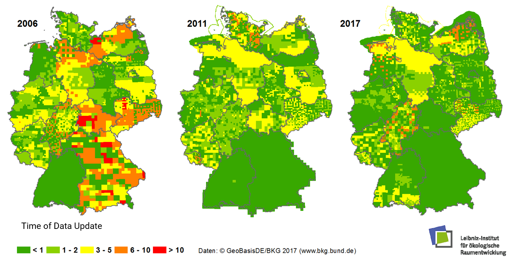

The need for **small-scale information is diverse**. This enables **the Science and Practice to optimize related measures, and decisions**, but it also increase efficiency to identify successes or mistakes. In particular, the challanges should be considered about the data - e.g. spatial and temporal resolution, objectivity, homogeneity, etc.

The data users are actors from the local, regional and national level to the international level. The applications of the data are, for example, meauring green volume, building urban air pollution scenarios, estimating property values or geothermal potential.

**Land Use** (Green Volume)  
  

! Please find more information [Umweltatlas-Berlin](http://fbinter.stadt-berlin.de/fb/index.jsp?loginkey=showMap&mapId=wmsk05_09_gruendvol2010@senstadt)

**Climate Adaptation** (Air Pollution) 
  
! Please explore on more Topics (Urban Climate, Noise mapping etc.) on: [LHS Stuttgart](http://gis6.stuttgart.de/maps/index.html?karte=stadtklima&embedded=true#basemap=0&centerX=3516118.9675944396&centerY=5406021.037465078&scale=25000&layerIds=279.281)

**Urban Planning** (Property Value)    

! Please find more information on urban planning on at city scale on: [LHS Dresden](http://stadtplan2.dresden.de/spdd.aspx?lang=de)

**Energy Research** (Onshore Wind-potential)    

! Let's have a look on global Information on energy reserch on: [IRENA-GlobalAtlas](https://irena.masdar.ac.ae/gallery/#map/543)

!! Please find more application and small scale informations at local, regional, national and internation level.

<!--
| | |
|:--:|:--:|
| **Flächennutzung** (Grünvolumen)   Quelle: [Umweltatlas-Berlin](http://fbinter.stadt-berlin.de/fb/index.jsp?loginkey=showMap&mapId=wmsk05_09_gruendvol2010@senstadt) | **Klimaanpassung** (Luftbelastung)   Quelle: [LHS Stuttgart](http://gis6.stuttgart.de/maps/index.html?karte=stadtklima&embedded=true#basemap=0&centerX=3516118.9675944396&centerY=5406021.037465078&scale=25000&layerIds=279.281) |
|  **Stadtplanung** (Bodenwerte)  Quelle: [LHS Dresden](http://stadtplan2.dresden.de/)  | **Energieforschung** (Geothermie-Potenzial)  Quelle: [IRENA-GlobalAtlas](https://irena.masdar.ac.ae/gallery/#map/1645) |

-->

The aim is to make the results of land use monitoring more accurate, i.e. more small-scale and robust. To achieve this, the methods of land use monitoring must be further improved.

- Information is required, for example, on the up-to-date (settlement density, use density), on land use change, landscape quality, building stock, -type, -age and -use), transport infrastructure (density, accessibility) or energy requirements.
- The information potential of existing official geodata is very high, but suject to utilize more intensively - such as "Hausumringen" [(HU-DE)](https://www.ldbv.bayern.de/produkte/kataster/hausumringe.html), Building locations [(GA)](http://www.geodatenzentrum.de/geodaten/gdz_rahmen.gdz_div?gdz_spr=deu&gdz_akt_zeile=2&gdz_anz_zeile=6&gdz_unt_zeile=19&gdz_user_id=0) oder 3D-building models [(LoD1-DE)](http://www.adv-online.de/AdV-Produkte/Weitere-Produkte/3D-Gebaeudemodelle-LoD/).

- User-generated data (Citizen Science) play an increasingly important role, besides new remote sensing data and new as well as updated official data.
- the data quality problems remain as an important concern (e.g. lack of timeliness, see also figure).
- Often there is still a lack of comprehensive dataset (e.g. on green spaces, small-scale population distribution).
- There is a massive mismatch between the comprehensive official data and the valid user-generated data (local).

**Up-to-dateness ATKIS Basic-DLM (Official Topographic-Cartographic Information System) on 2006, 2011 und 2017**

!!! Let's Think about: Why is the ATKIS Basic DLM an important basic data set?

! Please find more information on Up-to-dateness of ATKIS Basic-DLM (Official Topographic-Cartographic Information System): [www.ioer-monitor.de/methodik/glossar](https://www.ioer-monitor.de/en/methodology/glossary/a/atkis-basis-dlm/)
