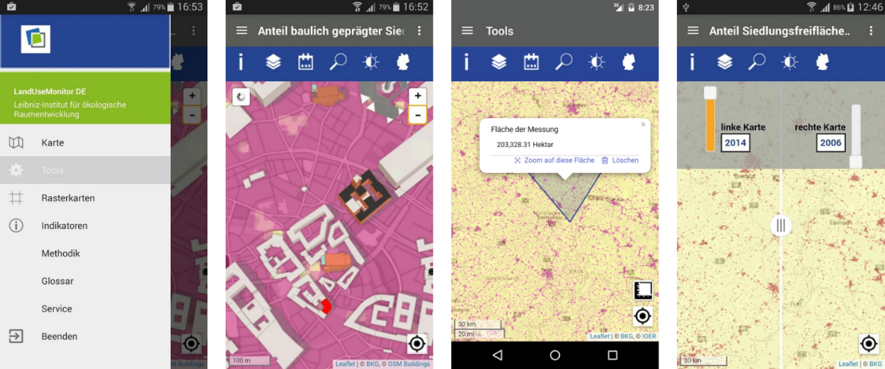

The IÖR Monitor offers a research data infrastructure with more than 80 indicators on the topic of land use monitoring in Germany. There is no fees for accessing data and services. This course module will use frequently the data/services and developed methodologies of the IÖR Monitor.

! Explore [IÖR-Monitor](http://www.ioer-monitor.de); 
! Short Video on: **[What is Monitor of Settlement and Open Space Development (IOER-Monitor)?](https://youtu.be/70Lf00SB7fc)**

A mobile app is also available in the Android Apps-store with all indicators of the IÖR Monitor.

! **Land Use Monitor DE**:  [Available on Apkpure store](https://apkpure.com/de/land-use-monitor-de/com.ioer.monitor)
