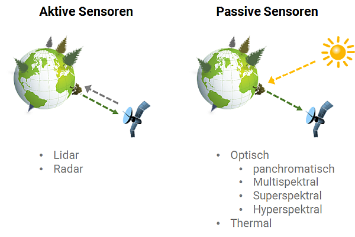

## Sensortypen

Grundsätzlich lassen sich Fernerkundungssensoren in zwei Gruppen einteilen:
1. _Aktive Sensoren_ senden elektromagnetische Strahlung aktiv aus und nehmen die von der Erdoberfläche zurückkommenden Signale wieder auf. Hierzu gehören etwa Lidar-Systeme (Light detection and ranging), die mit Laserstrahlen die Oberfläche abtasten, und Radar-Systeme (Radio direction and ranging), die Radiowellen abgeben und aufnehmen. Beispiele sind Satelliten wie [TerraSAR-X](https://www.dlr.de/dlr/desktopdefault.aspx/tabid-10377/565_read-436/#/gallery/350) und [Sentinel-1](https://www.d-copernicus.de/daten/daten-sentinels/).
2. _Passive Sensoren_ dagegen erzeugen keine eigene Strahlung, die sie dann wieder empfangen könnten, sondern nehmen die reflektierte Strahlung anderer Quellen wie der Sonne auf. Zu diesen zählen z.B. die Satelliten der [Landsat-Serie](https://landsat.usgs.gov/landsat-missions-timeline), [RapidEye](https://www.satimagingcorp.com/satellite-sensors/other-satellite-sensors/rapideye/), [Sentinel-2](https://www.d-copernicus.de/daten/daten-sentinels/) und die geplante hyperspektrale [EnMAP](http://www.enmap.org/)-Mission. Des Weiteren gibt es passive Sensoren wie Landsat 8, die auch im langwelligeren thermalen Infrarot arbeiten und die von der Erde emittierte Wärmestrahlung aufnehmen können.

  

Bei den passiven optischen Sensoren, gibt es eine Reihe an unterschiedlichen Systemen. Sie unterscheiden sich z.B. in der Anzahl der Kanäle, mit denen verschiedene Wellenlängenbereiche des elektromagnetischen Spektrums wahrgenommen werden können. Unsere Augen sind im Grunde auch passive Fernerkundungssensoren, die das sichtbare Licht von etwa 400-700 nm wahrnehmen - also nur einen kleinen Teil des gesamten Spektrums. Kurzwelligere oder langwelligere Strahlung können wir nur mit Hilfe von speziellen Kameras und Sensoren wahrnehmen. So wird quasi sichtbar gemacht, was für uns unsichtbar ist.

In der folgenden Abbildung sind einige der gängigsten aktiven und passiven Erdbeobachtungssatelliten gelistet. Die Einteilung nach Wellenlängenbereich und räumlicher Auflösung (Pixelgröße) ist dabei eine hilfreiche Methode um sich einen Überlick zu schaffen.

  

## Erdatmosphäre

Entscheidend für die Funktionsweise von Satelliten ist die atmosphärische Durchlässigkeit bzw. die sogenannten atmosphärischen Fenster. Die Erdatmosphäre blockiert einen Großteil der Sonnenstrahlung und lässt nur bestimmte Strahlung ungehindert bzw. abgeschwächt durch. Durch _Absorption_ (Englisch: absorption) wird die Energie der elektromagnetischen Strahlung abgeschwächt oder so stark blockiert, dass auf der Erdoberfläche nichts mehr davon ankommt. _Streuung_ (Englisch: scattering) hingegen beschreibt das Ablenken der Strahlung in eine andere Richtung ohne Absorbtion. Die Prozesse von Absorption und Streuung sind wellenlängenabhängig, wobei kurzwelligere Strahlung stärker gestreut wird:

- Die _Mie-Streuung_ tritt eher im sichtbaren Spektralbereich auf und wird in erster Linie durch größere Moleküle wie Wasser und Aerosole verursacht. Dabei entspricht deren Größe der jeweiligen Wellenlänge.
- Die _Rayleigh-Streuung_ wird von Molekülen verursacht, die kleiner sind als die Wellenlänge der jeweiligen Strahlung, und tritt vor allem im kurzwelligen Bereich auf wie ultraviolette Strahlung und in blauem Licht. Verantwortlich sind in erster Linie Sauerstoff, Kohlendioxid und Stickstoff. Die Rayleigh-Streuung ist u.a. dafür verantwortlich, dass der Himmel tagsüber blau erscheint und in der Dämmerung rötlich.

Im Gegensatz zu diesen sogenannten selektiven Streuungsvorgänge ist die nicht-selektive Streuung unabhängig von der Wellenlänge. Ein Beispiel ist etwa Dunst (Englisch: haze), der das sichtbare Licht gleichermäßig streut, oder Wolken, die uns weiß erscheinen.

 wahrnehmen. Quelle Abb. rechts: Albertz, 2001.")
  

Sonnenstrahlung durchdringt die Atmosphäre quasi zweimal: 1. auf dem Weg zur Erdoberfläche und 2. durch Reflexion von der Erdoberfläche. Daher kommt bei den Sensoren der Satelliten nur ein abgeschwächtes Signal an. Die Verluste und „Verfälschungen“ des Signals verfälschen gewissermaßen die Aufnahme und ergeben ein anderes Bild als am Boden.
Die Eigenschaften der Erdatmosphäre wirken sich besonders auf die optische Fernerkundung aus. Als weitaus kritischer sind Wolken zu sehen. Als Teil der Erdbeobachtung wird für die Landüberwachung ein weitestgehend wolkenfreier Himmel benötigt. Wolken und -schatten erschweren allerdings oft operationelle Anwendungen, besonders in tropischen Regionen aber auch in unseren Breiten. Die nachfolgende Abbildung zeigt beispielhaft unterschiedliche Grade an Wolkenbedeckung. Relativ unabhängig von der Atmosphäre sind dagegen etwa Radar-Sensoren. Sie erlauben jederzeit Aufnahmen, auch nachts und durch eine Wolkendecke hindurch.

 ESA")
  
