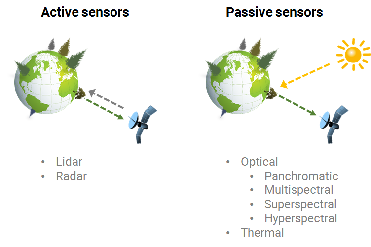

## Sensor types

Basically, remote sensing sensors can be divided into two groups:
1. _Active sensors_ actively emit electromagnetic radiation and pick up the signals coming back from the earth's surface. These include lidar systems (light detection and ranging), which scan the surface with laser beams, and radar systems (radio direction and ranging), which emit and pick up radio waves. Examples are satellites like [TerraSAR-X](https://www.dlr.de/dlr/desktopdefault.aspx/tabid-10377/565_read-436/#/gallery/350) and [Sentinel-1](https://www.d-copernicus.de/daten/daten-sentinels/).
2. _Passive sensors_, on the other hand, do not produce their own radiation, which they could then receive back, but receive the reflected radiation from other sources such as the sun. They include the satellites of the [Landsat series](https://landsat.usgs.gov/landsat-missions-timeline), [RapidEye](https://www.satimagingcorp.com/satellite-sensors/other-satellite-sensors/rapideye/), [Sentinel-2](https://www.d-copernicus.de/daten/daten-sentinels/) and the planned hyperspectral [EnMAP](http://www.enmap.org/) mission. In addition, there are passive sensors such as Landsat 8, which also work in the longer wavelength thermal infrared and can detect the thermal radiation emitted by the Earth.

  

The passive optical sensors have a number of different systems. They vary e.g. in the number of channels with which different wavelength ranges of the electromagnetic spectrum can be perceived. Basically, our eyes are also passive remote sensing sensors that can detect visible light from about 400-700 nm - only a small part of the entire spectrum. Shorter-wavelength or longer-wavelength radiation can only be perceived with the aid of special cameras and sensors. This makes visible what is invisible to us.

The following figure lists some of the most common active and passive Earth observation satellites. The classification according to wavelength range and spatial resolution (pixel size) is a helpful method to get an overview.

  

## Earth atmosphere

The atmospheric transmissibility or the so-called atmospheric windows are crucial for the functioning of satellites. The Earth's atmosphere blocks a large part of solar radiation and allows only certain radiation to pass unhindered or attenuated. Absorption attenuates or blocks the energy of electromagnetic radiation to such an extent that nothing reaches the Earth's surface. Scattering, on the other hand, describes the deflection of radiation in another direction without absorption. The processes of absorption and scattering are wavelength-dependent, with shorter-wavelength radiation being scattered more strongly:

- The _mie-scattering_ occurs rather in the visible spectral range and is primarily caused by larger molecules such as water and aerosols. Their size corresponds to the respective wavelength.
- _Rayleigh scattering_ is caused by molecules that are smaller than the wavelength of the respective radiation and occurs mainly in the short-wave range, such as ultraviolet radiation and in blue light. Oxygen, carbon dioxide and nitrogen are primarily responsible. Rayleigh scattering is responsible, among other things, for the fact that the sky appears blue during the day and reddish at dusk.

In contrast to these so-called selective scattering processes, non-selective scattering is independent of the wavelength. An example is haze, which scatters visible light equally, or clouds that appear white to us.

.  Source figure (right): Albertz, 2001.")
  

Solar radiation penetrates the atmosphere quasi twice: 1. on its way to the Earth's surface and 2. by reflection from the Earth's surface. Therefore only a weakened signal arrives at the sensors of the satellites. The losses and distortions of the signal falsify to a certain extent the recording and result in a different image than on the ground.
The properties of the Earth's atmosphere have a particular effect on optical remote sensing. Clouds are far more critical. As part of Earth observation, a largely cloudless sky is required for land monitoring. However, clouds and shadows often make operational applications difficult, especially in tropical regions but also in our latitudes. The following figure shows examples of different degrees of cloud cover. Radar sensors, on the other hand, are relatively independent of the atmosphere. They allow to take pictures at any time, even at night and through a cloud cover.

 ESA")
  
