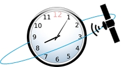

## Resolutions

! At this point the "Lexikon der Fernerkundung" (Lexicon of remote sensing) should be mentioned for reference: [FE-Lexikon](http://www.fe-lexikon.info/lexikon-a.htm#aufloesung). The glossary provides comprehensive information on remote sensing in general and in detail, such as the different types of resolutions.

### Spatial resolution
!!! The spatial resolution describes above all the pixel size and/or the pixel distance (in the picture or at the object) and thus the ability of the sensor for detail differentiation. It depends on the type of sensor, the size of the CCD array (charge-coupled device) and the viewing angle. 

Some important terms in remote sensing and their meaning are:
- FOV = field of view, defines the swath width.
- IFOV = instantaneous field of view, defines the angle of the individual sensors.
- GIFOV = ground instantaneous field of view, is the IFOV projected onto the ground.
- GSD = ground sample distance (from GIFOV, detector size), defines the resulting pixel size

The pixel size of the final image product thus depends on the sensor and fluctuates strongly between 0.4 and 900 m. For common free satellites they are 5 m (RapidEye), 30 m (Landsat 8) or 250/500 m (MODIS). Sentinel-2 has spatial resolutions of 10, 20 and 60 m depending on the channel. In addition to contrast, spatial image resolution is primarily decisive for the recognition and differentiation of objects.

### Radiometric resolution
!!! The radiometric resolution indicates the ability of a sensor to distinguish between different intensities within the respective wavelength range of a channel. Simply speaking, it is the contrast of an image, indicating the number of grayscales - expressed in bits:
- 1 bit = 21 = 2 gray levels
- 2 bit = 22 = 4 grey levels
- 4 bit = 24 = 16 grey levels
- 8 bit = 28 = 256 greyscales

### Spectral resolution
!!!  The spectral (optical) resolution of a sensor indicates which areas of the electromagnetic spectrum can be detected and how. The spectral resolution is therefore the covered wavelength range related to the number of spectral bands and is linked to the bandwidth, which is described by the Full Width Half Mean value (FWHM). This indicates the wavelength width that a channel has at 50% of the maximum transmittance of the spectral band. It is sometimes confused with the spectral sampling interval, but this defines the steps between the bands.

The following figure shows the position of the 13 Sentinel-2 channels within the electromagnetic spectrum. For example, a typical green vegetation reflectance curve is shown.

### Temporal resolution
!!! The temporal  resolution indicates the time span between two overflights (recordings) of the same object. it is particularly important in the context of operational monitoring and time series analyses.

For example, Sentinel-2 has a repetition rate at the equator of 5 days, Landsat 8 of 16 days, RapidEye 5 days. Due to larger overlaps of the recording strips, an image of the same place can even be produced every 2-3 days in Sentinel-2 at higher latitudes like in Germany.

