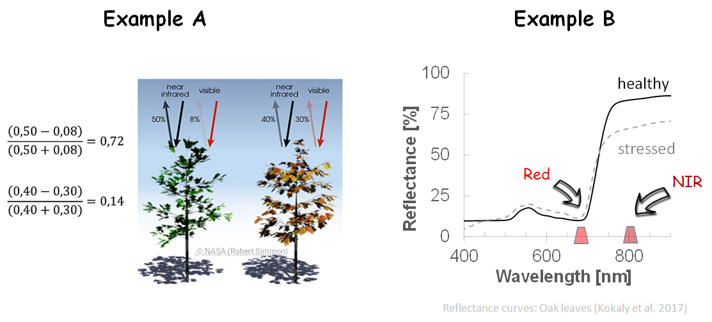

## Spectral properties of vegetation

Every kind of matter or surface reflects radiation, albeit in different strengths: soil, water (including snow and ice), sealed surfaces such as roads and buildings, or even vegetation (including agricultural land and forests).
When solar radiation hits an object or the Earth's surface, it is transmitted, absorbed or converted into energy and reflected back to different degrees in certain wavelengths.

!!! The concept of the spectral signature is often understood as something absolute, which does not always do adequate justice to the matter. Although the wavelength-dependent reflection is very typical for many surfaces and land cover types, a number of factors such as viewing angle and position of the sun, recording time and sensor type play a decisive role. In addition, there are the different characteristics of the target object.
Let's take forest trees as an example: sometimes they are densely packed, sometimes with large gaps, on a flat level, on steep slopes; young plants appear differently from old trees. And although differences between tree species can be significant, there is no *the one* signature for spruce or beech. It should be kept in mind that the situation is more diverse and must be considered on a case-by-case basis.

The reflectance curve of green healthy vegetation has a characteristic shape and is influenced by factors such as concentration of leaf pigments, water content and leaf structure. The following figure shows the typical appearance on the basis of a spectral curve of a beech crown (Aberle 2017) including main influencing factors. Click on the blue-backed white crosses in the following figure to obtain brief information.

<iframe src="https://h5p.org/h5p/embed/240206" width="100%" max-width=600 max-height="600" height=400 frameborder="0" allowfullscreen="allowfullscreen"></iframe>

## Vegetation indices
The information contained in the reflected radiation (e.g. pixel values of the individual sentinel-2 bands) can be examined directly or via newly created indices. Spectral indices follow the principle of a recalculation of an artificial channel to highlight special features. They are usually calculated as simple linear combinations or ratios. Depending on the sensor and the number of channels, there are many possible combinations.
Vegetation indices are more robust against lighting differences or atmospheric and background influences (Bannari et al. 1995, Huete, 2012).

The best known vegetation index is the _Normalized Difference Vegetation Index (NDVI)_ (Rouse, 1974). It is regarded as the standard for vegetation monitoring and takes advantage of the differences in the (health) status of plants. Stressed and dry vegetation reflects more strongly in red and especially less in near infrared (NIR).
NDVI (ranging between -1 and 1, is calculated as follows:

*NDVI = (NIR - red) / (NIR + red)* , [-1;1]

Clear water has a negative NDVI value close to -1. A NDVI of 0 means that there is no vegetation. The denser and more vital the vegetation, the higher the NDVI. Values against +1 represent healthy and very dense vegetation. In the following example the NDVI is compared to a normal color composite. The index was calculated from the red channel (band 4) and a NIR channel (band 8) and is available for each pixel. Image elements with little or no vegetation cover such as roads, built-up areas and fields appear brighter, as do the windthrow areas in the lower right half of the image. The densely overgrown deciduous tree areas, on the other hand, have the highest NDVI values and are shown here in dark.

<iframe src="https://h5p.org/h5p/embed/311729" width="100%" max-width=600 max-height="600" height=400 frameborder="0" allowfullscreen="allowfullscreen"></iframe>

!!!! The NDVI is only one of many indices: Search for indices in the [Index Database](https://www.indexdatabase.de/) for Sentinel-2 and other sensors. Look for examples and compare them with each other. Compare the indices also on the [Sentinel Playground](https://apps.sentinel-hub.com/sentinel-playground/?source=S2&lat=50.03619419013074&lng=8.040962219238281&zoom=13&preset=1_NATURAL_COL0R&layers=B02,B12,B08&maxcc=20&gain=1.0&gamma=1.0&time=2015-01-01|2018-05-17&atmFilter=&showDates=false).
  

! For a better understanding, the Sentinel Hub provides a good overview of the individual channels, their possible combinations and application examples, as well as the representation of different vegetation indices: [Sentinel-2 EO products](https://www.sentinel-hub.com/develop/documentation/eo_products/Sentinel2EOproducts)
  
