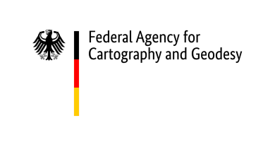

  

The German Federal Agency for Cartography and Geodesy (Bundesamt für Kartographie und Geodäsie, BKG) is the central federal service provider for topographic basic data, cartography and geodetic reference systems. In the fields of geodesy and geoinformation, the BKG advises federal institutions and represents the federal government's professional interests at international level.  

We encounter the question of "where" almost everywhere. A large number of activities in the public and private sectors have a spatial reference and are based on geoinformation - data that describe our environment, our climate, traffic information or our economic structure. The Geoinformation section of the BKG develops processes, products and services with which geodata can be used and combined highly efficiently. Remote sensing data also plays an important role here.

Remote sensing data can be used in a variety of applications:
- for the regular monitoring of changes and the acquisition of environmental information,
- on resource management in agriculture and forestry,
- the mapping and planning of settlements and infrastructures and
- in the event of civil damage.

The BKG is currently strengthening its activities in the field of satellite-based remote sensing and is participating in the Copernicus Earth Observation Programme. Moreover, the BKG is the national technical coordinator for the land monitoring service.

! You will find us here:  
! [www.bkg.bund.de](https://www.bkg.bund.de/EN/Home/home.html)  
! [twitter.com/BKG_Bund](https://twitter.com/BKG_Bund)  
  
