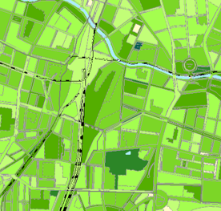
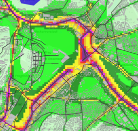
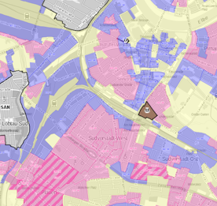

Der Bedarf an kleinräumigen Informationen ist vielfältig. Dabei können Praxis und Wissenschaft zukünftige Entscheidungen optimieren, aber auch die bisherigen Erfolge oder Fehler genauer identifizieren. Hier sollen auch die Anforderungen an die Daten betrachtet werden – z.B. räumlich, objektiv, homogen usw. Die Anwendungsfelder reichen von Akteuren von der lokalen über die nationale bis hin zur internationalen Ebene, z. B. bzgl. Grünvolumen, Stadtluftbelastungsszenarien, Bodenwerte oder auch das Geothermie-Potential.

**Flächennutzung (Grünvolumen)**

[Umweltatlas-Berlin](http://fbinter.stadt-berlin.de/fb/index.jsp?loginkey=showMap&mapId=wmsk05_09_gruendvol2010@senstadt)

**Klimaanpassung (Luftbelastung)**

[LHS Stuttgart](http://gis6.stuttgart.de/maps/index.html?karte=stadtklima&embedded=true#basemap=0&centerX=3516118.9675944396&centerY=5406021.037465078&scale=25000&layerIds=279.281)

**Stadtplanung (Bodenwerte)**

[LHS Dresden](http://stadtplan2.dresden.de/(S(oeqbrjpzbm5s4tydywh1vlbm))/spdd.aspx?TH=UW_WANDERWEGE)

**Energieforschung (Geothermie-Potenzial)**

[IRENA-GlobalAtlas](https://irena.masdar.ac.ae/gallery/#map/1645)

- Benötigt werden Informationen zur Flächennutzungsänderung und der Landschaftsqualität, des Gebäudebestandes, oder zukünftiger Verkehrsformen (Ausnutzungsdichte, Einwohnerdichte, Gebäudetyp,-alter, -nutzung, Energiebedarf, Erreichbarkeit, usw. auch durch nutzergenerierte Daten)
- Informationspotenzial von HU-DE, GA, LoD1-DE, VGI hoch, aber noch ungenügend ausgeschöpft
- Nutzergenerierte Daten spielen eine immer wichtigere Rolle neben neuen und weiterentwickelten amtliche Daten
- Datenqualitätsprobleme (mangelnde Aktualität, s. Abb. 3)
- Ggf. bisher fehlende amtliche Daten (z.B. zur Grünflächenausstattung usw.)
- Flächendeckung amtlicher Daten vs. genauere lokale nutzergenerierte Daten

