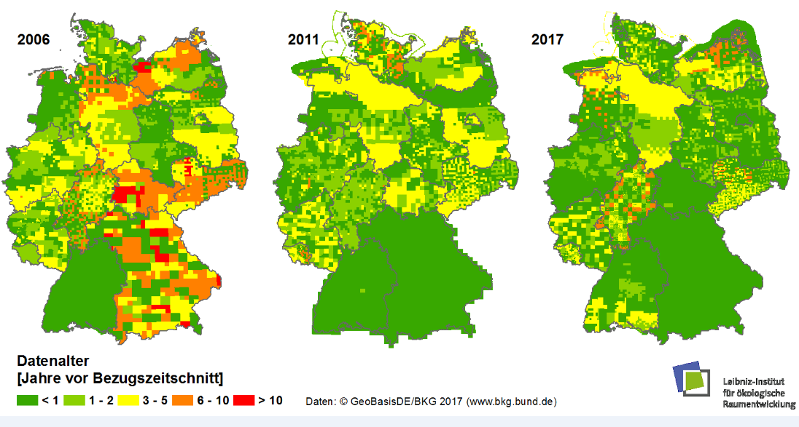

Der Bedarf an **kleinräumigen Informationen ist vielfältig**. Damit können **Wissenschaft und Praxis Maßnahmen und Entscheidungen optimieren**, aber auch die bisherigen Erfolge oder Fehler genauer identifizieren. Hier sollen insbesondere die Anforderungen an die Daten betrachtet werden – z. B. räumliche und zeitliche Auflösung, Objektivität, Homogenität usw. Nutzer der Daten sind Akteure von der lokalen über die regionale und nationale bis hin zur internationalen Ebene. Die Anwendungsfelder der Daten sind z. B. Grünvolumen, Stadtluftbelastungsszenarien, Bodenwerte oder das Geothermie-Potential.

<table>
<thead>
<tr>
<th></th>
<th></th>
</tr>
</thead>
<tbody>
<tr>
<td> <strong>Flächennutzung</strong>  (Grünvolumen) </td>
<td> <strong>Klimaanpassung</strong>  (Luftbelastung)  </td>
</tr>
<tr>
<td></td>
<td></td>
</tr>
<tr>
<td> Quelle: <a href="http://fbinter.stadt-berlin.de/fb/index.jsp?loginkey=showMap&amp;mapId=wmsk05_09_gruendvol2010@senstadt" rel="nofollow">Umweltatlas-Berlin</a> </td>
<td> Quelle: <a href="http://gis6.stuttgart.de/maps/index.html?karte=stadtklima&amp;embedded=true#basemap=0&amp;centerX=3516118.9675944396&amp;centerY=5406021.037465078&amp;scale=25000&amp;layerIds=279.281" rel="nofollow">LHS Stuttgart</a> </td>
</tr>
<tr>
<td> <strong>Stadtplanung</strong>  (Bodenwerte) </td>
<td> <strong>Energieforschung</strong>  (Geothermie-Potenzial) </td>
</tr>
<tr>
<td></td>
<td></td>
</tr>
<tr>
<td> Quelle: <a href="http://stadtplan2.dresden.de/" rel="nofollow">LHS Dresden</a> </td>
<td> Quelle: <a href="https://irena.masdar.ac.ae/gallery/#map/1645" rel="nofollow">IRENA-GlobalAtlas</a> </td>
</tr></tbody></table>

- Benötigt werden z. B. Informationen zur Realsituation (Siedlungsdichte, Ausnutzungsdichte), zur Flächennutzungsänderung, zur Landschaftsqualität, zum Gebäudebestand Gebäudetyp, -alter, -nutzung), zur Verkehrsinfrastruktur (Dichte, Erreichbarkeit) (, , zum Energiebedarf,. Hier spielen auch nutzergenerierte Daten eine immer größere Rolle.
- Dabei ist das Informationspotenzial von bestehenden amtlichen Geobasisdaten wie Hausumrigen [(HU-DE)](https://www.ldbv.bayern.de/produkte/kataster/hausumringe.html), Gebäudeadressen [(GA)](http://www.geodatenzentrum.de/geodaten/gdz_rahmen.gdz_div?gdz_spr=deu&gdz_akt_zeile=2&gdz_anz_zeile=6&gdz_unt_zeile=19&gdz_user_id=0) oder 3D-Gebäudemodellem [(LoD1-DE)](http://www.adv-online.de/AdV-Produkte/Weitere-Produkte/3D-Gebaeudemodelle-LoD/) hoch, bisher aber noch ungenügend ausgeschöpft.
- Nutzergenerierte Daten spielen eine immer wichtigere Rolle neben neuen Fernerkundungsdaten und neuen und weiterentwickelten amtlichen Daten
- Es gibt nach wie vor Datenqualitätsprobleme (mangelnde Aktualität, s. Abb.)
- Häufig fehlen noch flächendeckende Datenangebote (z. B. zur Grünflächenausstattung, kleinräumigen Bevölkerungsverteilung)
- Flächendeckung amtlicher Daten vs. genauere lokale nutzergenerierte Daten

**Grundaktualität des [ATKIS Basis-DLM](http://www.ioer-monitor.de/methodik/glossar/a/atkis-basis-dlm/)**
