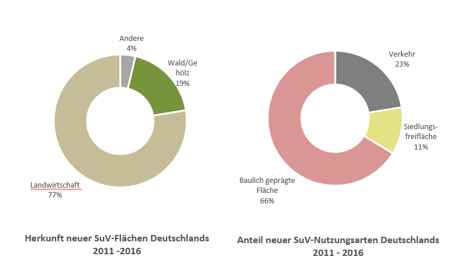
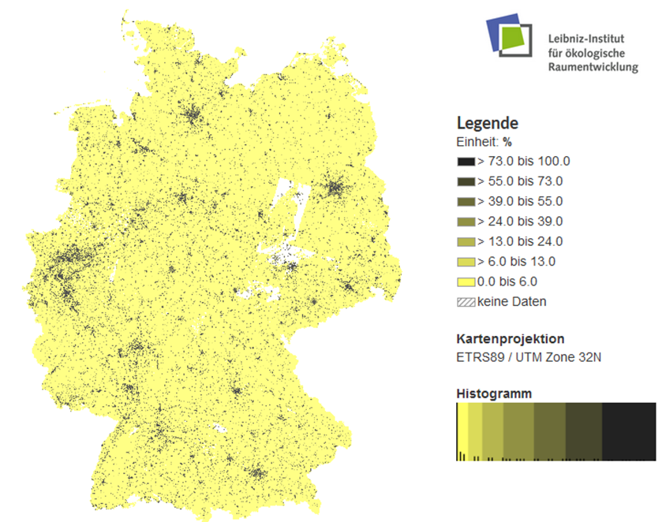
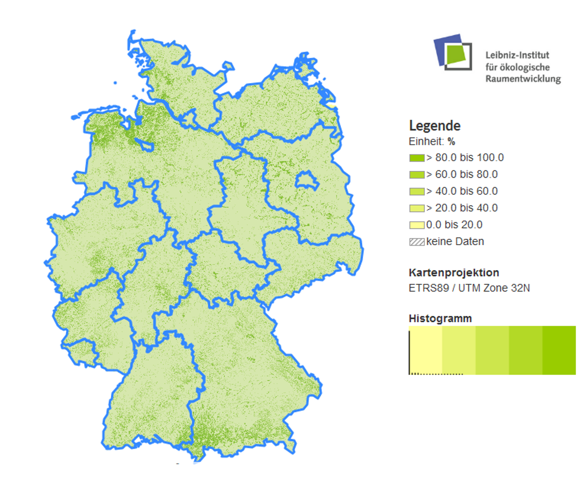
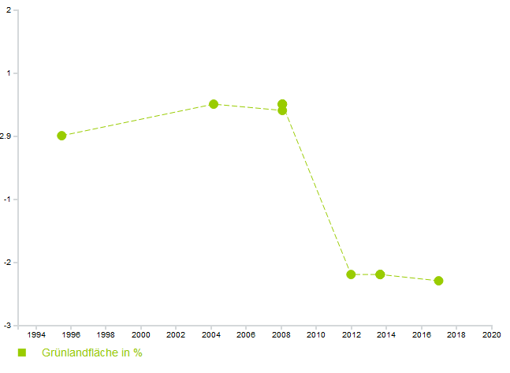

# Analysebeispiele von Flächenmonitoring-Ergebnissen

Neben der amtlichen Flächenstatistik, der für die alten Bundesländer seit 1980 existierenden sekundärstatistischen Erhebung, bietet der IÖR-Monitor Daten zur Flächennutzungsentwicklung auf Grundlage des ATKIS Basis-DLM.

Eine Auswahl dieser IÖR-Monitoring-Ergebnisse wird im Folgenden vorgestellt:

 

### Anteil der Verkehrsfläche an der Siedlungs- und Verkehrsfläche (2017)

### Flächenumnutzungsstatistik (2011-2016)

### Anteil bauliche geprägter SuV  in Überschwemmungsgebieten: Räumlicher Trend in den Bundesländern

Hier ist die prozentuale Anteil der baulich geprägten Siedlungs- und Verkehrsfläche an den Überschwemmungsgebieten in den Bundesländern Deutschlands dargestellt.

### Flächenneuinanspruchnahme auf Gemeindeebene (2014)

Hier sehen Sie die Flächenneuinanspruchnahme auf Gemeindeebene.

### Bodenversiegelung auf Kreisebene (2015)

Hier ist der Bodenversiegelungsgrad (2015) auf Kreisebene bundesweit dargestellt.

Nachfolgend sehen Sie die Struktur des Bodenversiegelungsgrad in einer Rasterkarte (100*100m).

### Bodenversiegelung in der Landeshauptstadt Dresden

Hier ist die Bodenversiegelung in der Landeshauptstadt Dresden dargestellt.

### Grünlandfläche an Gebietsfläche

Die Karte zeigt den Anteil der Grünfläche an der Gebietsfläche (500*500m Raster)

Hier sehen Sie die Veränderung des Anteils der Grünlandfläche im Diagramm (Bundeshauptstadt Berlin, 2016)

### Entwicklung der Siedlungsdichte und Bevölkerung

Hier sieht man die Entwicklung der Siedlungsdichte und Bevölkerung, differenziert nach Gemeindegrößen (unten).

### Veränderung der Siedlungsdichte auf Gemeindeebene (2008-2015)

Hier sehen Sie die Veränderung der Siedlungsdichte auf Gemeindeebene.

 

!!! **Weitere Analyse finden Sie auf:**  http://www.ioer-monitor.de/ergebnisse
