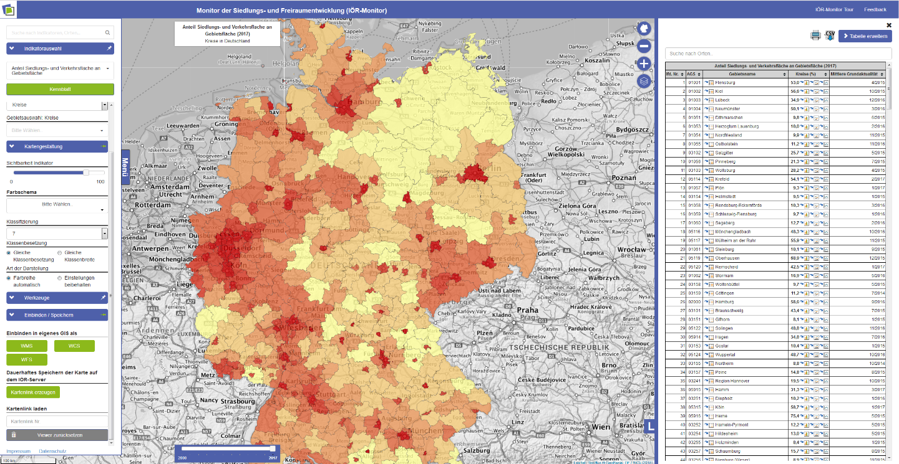
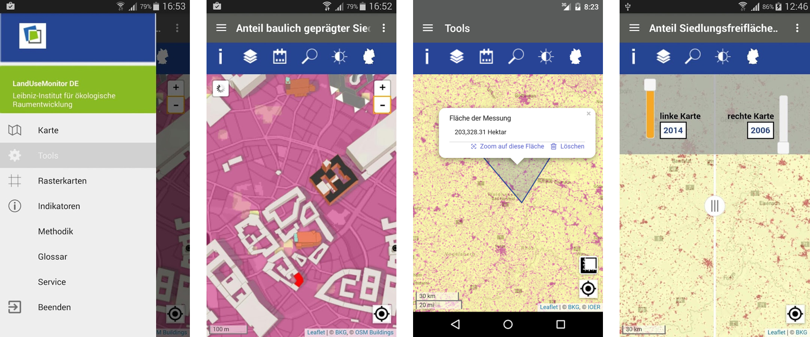

Flächemonitoring IÖR-Monitor – eine Geoinformation dienste mit 75 Indikatoren, alles Daten sind kostenlos zugreifbar. Für diesen Kurs würden wir Daten Grundlage von IÖR-Monitor anwenden und auch die langjährige Methoden Kenntnisse. 

Eine Mobil App ist auch im Androide Apps-store verfügbar mit allen Indikator des IÖR-Monitor

[center] !! Hier geht es zur Übung [/center]
