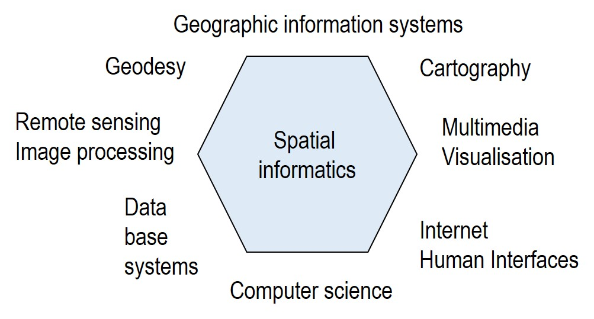

Geoinformatics as a scientific discipline is a so-called "hyphen informatics" like bioinformatics, medical informatics or environmental informatics and is based on concepts and methods of computer science, but is initiated from the application disciplines and is also strongly rooted in these. In this respect, the research and development of spatial concepts and technologies took place from the 1980s onwards, initially without significant contributions from computer science, e.g. in geography, geodesy, photogrammetry, cartography, hydrology and planning sciences. The topic of spatial reference has only been taken up increasingly in recent decades in computer science, e.g. in database and visualisation development, in robotics or in data warehousing.

