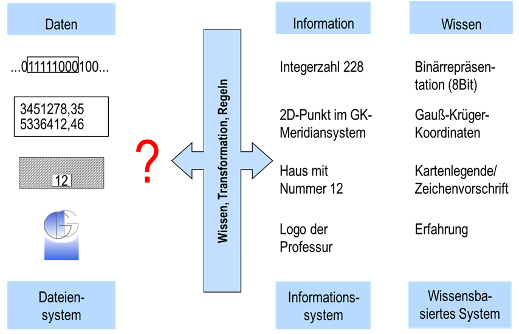

**Daten**: Zeichen, die durch einen Computer gespeichert, verglichen, verarbeitet und geschrieben werden können. Erweitertes Verständnis von Zeichen schließt Bilder, Texte, Graphiken, Symbole etc. ein.

**Information**: Zweckbezogenes Wissen als Ergebnis der Anwendung von Transformationen, Regeln und Wissen von demjenigen, der mit den Daten vertraut ist, um daraus neue Fakten und interpretierbare Ergebnisse in einem gegebenen Rahmen zu erstellen.
Oberste Ebene: Verständigungsebene (Pragmatik) dient dem eigentlichen Zweck der Sprache, Wissen zu vermitteln.
Mittlere Ebene: Bedeutungsebene (Semantik). Mit Hilfe der Bedeutung der Sprache kann sich ein Mensch mit anderen verständigen.
Unterste Ebene: Zeichenebene (Syntax) verwendet Zeichen von vereinbarter Form als Träger von Bedeutung.

**Wissen**: Menge aller von einem Wissensträger als wahr angenommenen Aussagen über die repräsentierte Welt, die tatsächlich wahr sind.

Ein Beispiel:

+ Die dargestellte Zeichenfolge aus 0 und 1 stelle eine Binärdarstellung dar, der angedeutete Rahmen umschließt eine 8er Bitfolge. Mit den Regeln zur Wandlung einer Binärdarstellung in eine Dezimalzahl lässt sich der Wert der Binärfolge 11111000 berechnen zu 0 * 2^0 + 0 * 2^1 + 0 * 2^2 + 1 * 2^3 + 1 * 2^4 + 1 * 2^5 + 1 * 2^6 + 1 * 2^7 = 228.
+ In der Mitte ist das Zahlentupel 3451278,35; 5336412,46 dargestellt, welches sich bei genauerer Betrachtung unter Nutzung des Wissens zu Koordinaten - und hier speziell zu Gauß-Krüger-Koordinaten - als zweidimensionaler Punkt im Gauß-Krüger-Koordinatensystem erweist. Dieser Punkt liegt im 3. Meridianstreifen - die Führungsziffer deutet dies an - gut 49 km westlich von 9° östlicher Länge (Rechtswert). Der Punkt ist 5336412,46 m entfernt vom Äquator (Hochwert).
+ Beim unteren graphischen Symbol könnte es sich - bei entsprechendem Wissen über die Zeichenvorschriften in Karten - um die Darstellung eines Wohngebäudes mit der Hausnummer 12 zur Straße zeigend in einer Katasterkarte handeln.
+ Und zu guter Letzt erkennt man nur mit dem Vorwissen über die Professur für Geodäsie und Geoinformatik, dass es sich hier um das Logo der Professur handelt.
