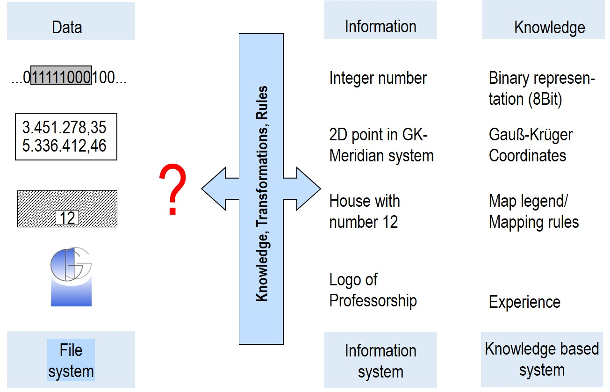

**Data**: Characters that can be stored, compared, processed and written by a computer. Extended interpretation of characters includes images, text, graphics, symbols, etc.

**Information**: Purposeful knowledge as a result of the application of transformations, rules and knowledge by the person familiar with the data to produce new facts and interpretable results within a given framework. 
- Top level: The level of communication (pragmatics) serves the actual purpose of the language to convey knowledge. 
- Middle level: Meaning level (semantics). With the help of the meaning of language, a person can communicate with others. 
- Lowermost level: Sign level (syntax) uses signs of agreed form as carriers of meaning.

**Knowledge**: Amount of all statements about the represented world which are actually true and which are assumed to be true by a knowledge carrier.

**An example:** 

- The displayed character sequence of 0 and 1 represents a binary representation, the indicated frame encloses an 8 bit sequence. With the rules for converting a binary representation into a decimal number, the value of the binary sequence 11111000 can be calculated to 0 2^0 + 0 2^1 + 0 2^2 + 1 2^3 + 1 2^4 + 1 2^5 + 1 2^6 + 1 2^7 = 248.
- In the middle the number tuple 3451278,35; 5336412,46 is shown, which turns out to be a two-dimensional point in the Gauß-Krüger coordinate system on closer inspection using the knowledge about coordinates - and here especially about Gauß-Krüger coordinates as former coordinate reference system in Germany. This point lies in the 3rd meridian strip - the leading number indicates this - a good 49 km west of 9° eastern longitude (Easting). The point is 5336412,46 m away from the equator (Northing).
- The lower graphic symbol could be - with appropriate knowledge about the sign regulations in maps - the representation of a residential building with the house number 12 pointing to the street in a cadastral map.
- And last but not least, you can only see that this is the logo of the professorship if you have previous knowledge about the Chair of Geodesy and Geoinformatics.

