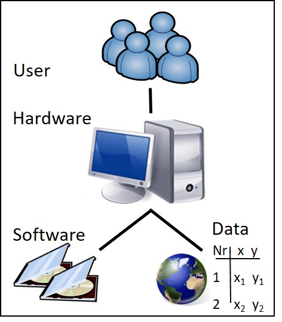

An information system (IS) serves the computer-aided collection, storage, processing, management, analysis, use, distribution, disposition, transmission and display of information or data. ([en.wikipedia.org/wiki/Information System](https://en.wikipedia.org/wiki/Information_system))

Usually every information system requires the four system elements hardware, software, data and user. An information system usually provides four functional components for processing: Input, management, analysis and presentation of information (the IMAP model, cf. Bill, 2016:5).

