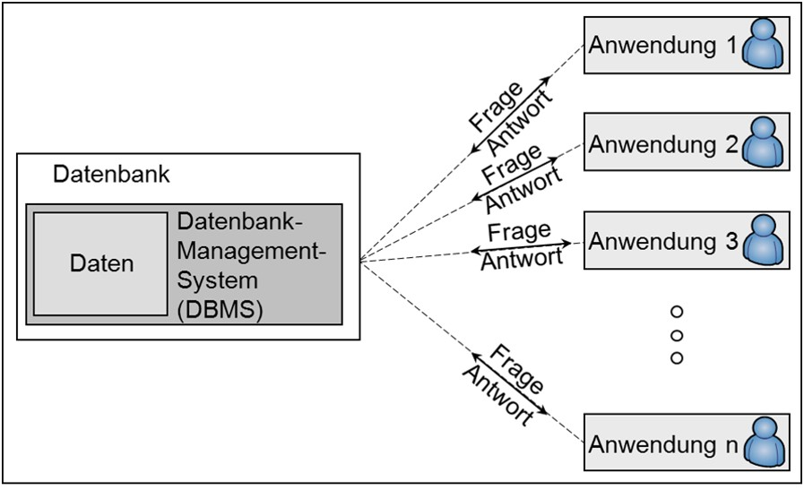

A database system (DBS) is a system for electronic data management, which can store large amounts of data efficiently, consistently and permanently and provide required subsets in different, demand-based forms of presentation for users and application programs. A DBS answers questions of users without the user having to know how the data are structured in the database management system (DBMS).

