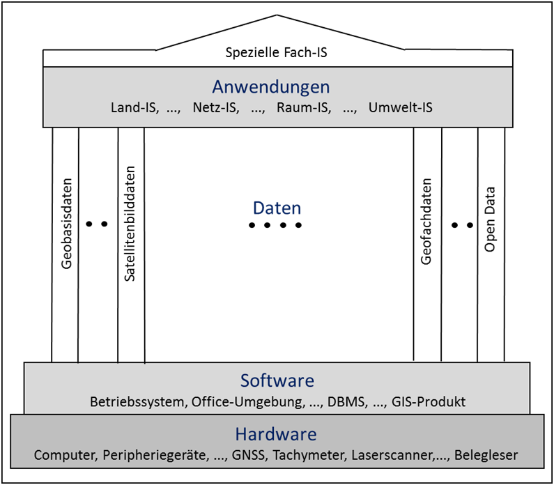

Vergleichen wir einmal den Grundaufbau eines GIS mit einem griechischen Tempel. Das Fundament und die unteren Treppenstufen sind sicher nicht das, was den Besucher zum Betrachten einlädt. Analog gilt dies auch für Hardware und Software, die selbstverständlich wesentlich zum Betrieb des GIS beitragen, jedoch nicht die inhaltlich und optisch reizvollsten Teile des GIS darstellen.

Die Hardware bildet im GIS das Fundament. Hierzu zählen der Arbeitsplatzcomputer, das Netzwerk, die Server, Peripheriegeräte wie Drucker, Plotter und Digitalisiereinrichtungen, zunehmend aber auch Geräte, die zum Feldeinsatz kommen wie Vermessungsinstrumente – so z. B. die satellitengestützten Vermessungstechniken mittels GNSS (Global Navigation Satellite System) – oder Smartphones, mit denen der Bürger sowohl Geoinformationsnutzer als auch -erzeuger sein kann. 

Die Software stellt die Treppenstufen dar, mit denen es ermöglicht wird, den Tempel zu besteigen, d.h. Daten in das GIS einzuarbeiten und Anwendungen mit dem GIS zu bearbeiten. Zur Software zählen das Betriebssystem, die Office-Umgebung, das Internet, das Datenbanksystem und die GIS-Produkte mit ihren vielfältigen Fachmodulen/Fachschalen. 

Die Säulen des Tempels sind dagegen in der Regel schon mit ein Vorzeigemerkmal unseres Tempels, es gibt sie in den unterschiedlichsten Stilen und sie tragen den Fries und das Dach. Die Säulen unserer Anwendungen stellen die Geodaten dar: Geobasisdaten - aus Luftbildern berechnete Orthophotos, Satellitenbilder, Digitale Gelände- und Oberflächenmodelle - sowie eine Vielzahl von Fachdaten, Sensordaten oder von Freiwilligen erhobene Daten (Volunteered Geographic Information (VGI)) bilden zusammen den großen Geodatenfundus. Sie stellen den Rohstoff dar, aus dem die GIS-Anwendungen gespeist werden. 

Die geschmückten Friese und die Dachkonstruktion überspannen die Säulenkonstruktion unseres Tempels. Analog sitzen an dieser Stelle im GIS die vielfältigen Anwendungsmöglichkeiten, die vom Aufbau notwendiger Basisinformationen z. B. zu den Besitzverhältnissen an Grund und Boden oder topographischen Datensammlungen (sogenannte Land-Informationssysteme (LIS), z. B. aktuell das AAA-Vorhaben (AFIS-ALKIS-ATKIS)) über eine Vielzahl von Geo-Informationssystemen in bestimmten Anwendungsgebieten (z. B. Netz-Informationssysteme (NIS) bei Ver- und Entsorgungsunternehmen, Raum-Informationssysteme (RIS) bei der amtlichen Statistik, Raumordnung und Landesplanung, Umwelt-Informationssysteme (UIS) bei Umweltbehörden oder in Unternehmen) bis hin zu einer Vielzahl ganz spezieller Fach-Informationssysteme (FIS) z. B. im Tourismusbereich führen.
