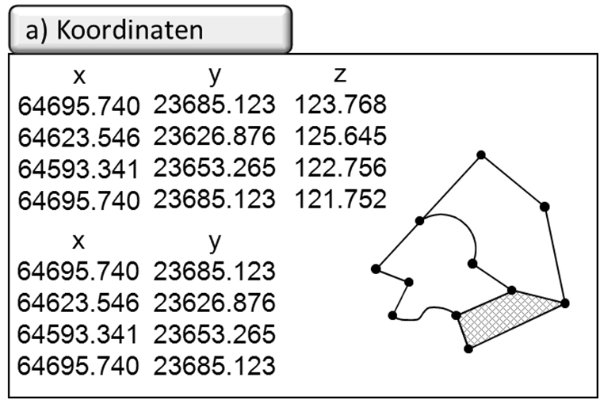
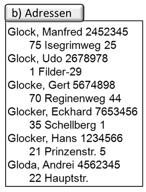
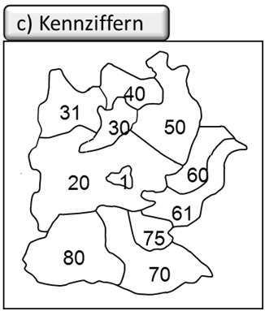
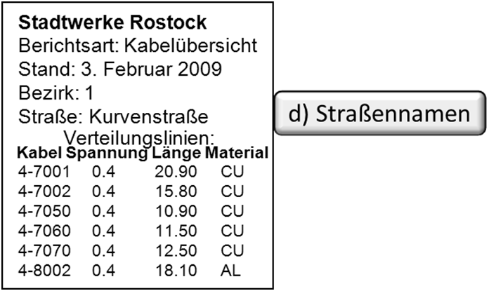

Das verbindende Element in GIS ist der Raumbezug. Aussagen aus Expertenkreisen weisen bis zu 80% der in Unternehmen und Verwaltungen verarbeiteten Informationen einen Raumbezug zu, womit sich das große Einsatzpotenzial der GIS erahnen lässt. Dieses stellt sich je nach der Fragestellung des Nutzers allerdings sehr unterschiedlich dar. Im Vermessungswesen ist ein direkter Raumbezug (vgl. ISO 19111) über die Angabe von zwei- oder dreidimensionalen Koordinaten oder entsprechenden Konstruktionsvorschriften angegeben, denen ein definiertes Koordinatenbezugssystem und eine primäre Metrik, d.h. mathematisch klar definierte Eigenschaften wie die Abstandsberechnung nach dem Satz von Pythagoras, zugrunde liegt.

In anderen Bereichen wie z. B. der amtlichen Statistik oder im Geomarketing beruht der Raumbezug auf vollständig anderen Fakten. Diese beinhalten zumeist eine schwächer definierte Metrik – auch sekundäre Metrik oder indirekter Raumbezug (ISO 19112 - Raumbezug mit geographischen Identifikatoren) genannt – und eine wesentlich geringere Genauigkeit. Sie sind zumeist flächenbezogen und weniger scharf abgegrenzt. Typische Raumbezugsgrößen sind:

+ **Namen** als räumliche Bezeichnungen (z. B. Orts-, Stadtteil-, Gemarkungs-, Flurnamen oder Lagebezeichnungen), die grob ein Gebiet umschreiben. In geographischen Namensverzeichnissen, sogenannte Gazetteers, werden für die Bezeichner jeweils entsprechende Geometrien in geographischen Koordinaten hinterlegt, um etwa für einen Flussnamen den Flussverlauf als Linienzug in geographischen Koordinaten zuordnen zu können, bzw. für eine Punktkoordinate einen Landesnamen abfragen zu können.
+ **Adressen** wie Stadt, Straßenname, Hausnummer als Basis einer Vielzahl von Datenerhebungen z. B. im Einwohnermeldewesen, in der Fahrzeugzulassung oder in der Ver- und Entsorgungswirtschaft.

+ **Kennziffern** als Platzhalter für räumliche Gebietsgliederungen wie Postleitzahlen, Telefonvorwahlen, Gemeindekennziffern, Wahlbezirksnummern, Flurstücksnummern, Nielsen-Gebiete im Geomarketing, NUTS (Nomenclatura des unites territoriales statistiques) als Systematik der Gebiets- und Verwaltungseinheiten in Europa etc. Diese Systeme unterliegen immer wieder Änderungen und oftmals sind die unterschiedlichen Raumgliederungen untereinander auch nicht räumlich deckungsgleich und somit aufwändig ineinander zu überführen.

+ **Andere** wie z. B. Kilometrierungen und Stationierungen entlang von Verkehrs- und Gewässerwegen oder kleinräumigere Gliederungen unterhalb der Gemeindeebene (z. B. Marktzellen auf Haushaltsbasis oder Baublöcke).
