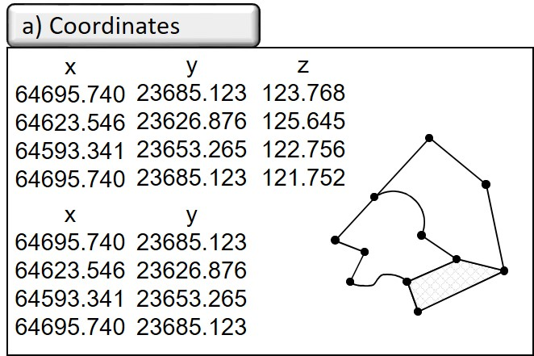
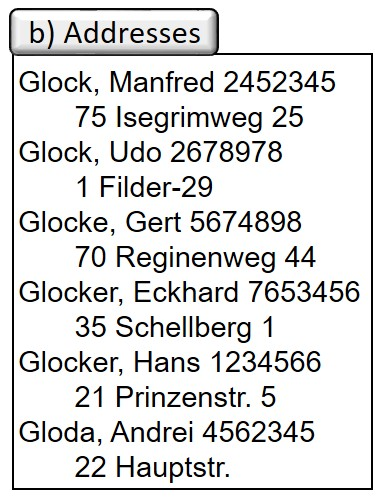
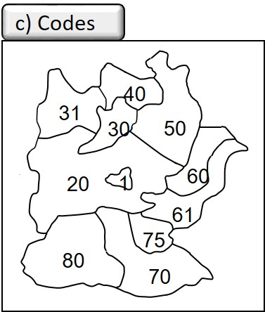
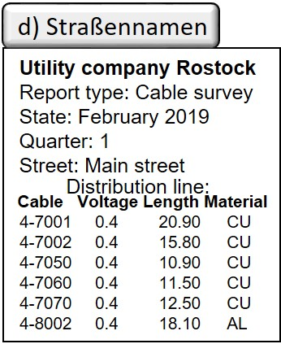

The connecting element in GIS is the spatial reference. Statements from expert circles assign up to 80% of the information processed in companies and administrations to a spatial reference, which gives an idea of the great application potential of GIS. Depending on the question posed by the user, however, this potential varies greatly. In surveying, a direct spatial reference (cf. ISO 19111 Geoinformation - coordinate reference systems) is given by the specification of two- or three-dimensional coordinates or corresponding construction regulations, which are based on a defined coordinate reference system and a primary metric, i.e. mathematically clearly defined properties such as the distance calculation according to the Pythagoras theorem.

In other areas, such as official statistics or geomarketing, the spatial reference is based on completely different facts. These mostly include a less well defined metric - also called secondary metric or indirect spatial reference (ISO 19112 Geoinformation - spatial reference with geographical identifiers) - and a much lower accuracy. They are mostly area-related and less sharply defined. Typical spatial reference variables are:

- Names as spatial designations (e.g. place names, district names, field names or location designations) that roughly describe an area. In geographical name directories, so-called gazetteers, corresponding geometries are stored in geographical coordinates for each identifier in order to be able to assign the course of a river as a line in geographical coordinates for a river name, for example, or to be able to query a country name for a point coordinate.
- Addresses such as city, street name, house number as the basis for a large number of data surveys, e.g. in residents' registration, vehicle registration or in the supply and waste disposal industry.

- **Indicators** as placeholders for spatial territorial divisions such as postal codes, telephone codes, municipal codes, electoral district numbers, parcel numbers, Nielsen areas in geomarketing, NUTS (Nomenclatura des unités territoriales statistiques) as a system of territorial and administrative units in Europe. These systems are subject to constant change, and often the different spatial divisions are not spatially congruent and therefore difficult to merge.
- Others such as **kilometre markings** and stationing along traffic routes and waterways or smaller-scale subdivisions below the municipal level (e.g. market cells on a household basis or building blocks).