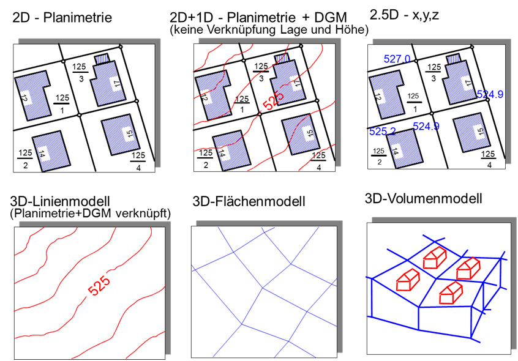

Bis hier sind die Geoobjekte überwiegend als statisch und räumlich zweidimensional angenommen worden. Die den Geoobjekten zu Grunde liegenden Geophänomene sind jedoch fast immer räumlich dreidimensional und zeitlich dynamisch.

Die Höhe als dritte räumliche Dimension wird in GIS meist als thematisches Attribut geführt, diese Modellierung wird dann als 2.5D bezeichnet. GIS bieten eine Fülle von Funktionen um mit Geländemodellen zu arbeiten. Weitere Funktionen unterstützen etwa die Bestimmungen von Geländeneigung und -exposition, die Ableitung von Fließwegen, Einzugsgebieten und weiteren geländemorphologischen Parametern. Weiterhin werden die Höhenangaben für die Pseudo-3D-Visualisierung genutzt. Jedoch finden sich in GIS selten echte 3D-Modellierungen und Funktionen um etwa Volumina, Volumenmittel oder Schnittflächen zu bestimmen.

Um die Dynamik (Zeit als Dimension) eines Geoobjektes zu berücksichtigen lassen sich grob zwei Ansätze unterscheiden. Der **snapshot Ansatz** basiert auf der Idee einer Momentaufnahme aller Attributwerte eines Geoobjekts zu einem bestimmten Zeitpunkt. Ein naheliegendes Beispiel hierfür ist eine Volkszählung, die oft in großen Zeitabständen einmal Daten zur Bevölkerung u.a. auf Basis administrativer Einheiten erhebt. Hier lässt sich allerdings nur feststellen, dass für ein spezielles Geoobjekt (z. B. eine Gemeinde) eine Änderung (z. B. der Einwohnerzahl) eingetreten ist, allerdings nicht wann genau diese Änderung eingetreten ist. Da, um einen neuen Zustand zu speichern, ein snapshot immer für alle Geoobjekte gemacht wird, ist dieser Ansatz außerdem recht speicherintensiv. Dem gegenüber steht der **timestamp Ansatz**. Hier werden nur die Attribute eines Geoobjekts betrachtet, für die sich ein Wert geändert hat. Der neue Wert wird mit dem Zeitstempel der Änderung versehen. So können etwa Messreihen oder auch mobile Objekte dargestellt werden: Bei jeder Ortsänderung wird die neue Position des Objektes (z. B. eines Fahrzeugs) mit einem Zeitstempel versehen und gespeichert. Diese Art der Modellierung ist speichereffizienter und es lässt sich leicht ermitteln, wann sich ein Wert geändert hat. Sollen jedoch für alle betrachteten Objekte die Wertzustände zu einem bestimmten Zeitpunkt ermittelt werden, sind wiederum aufwändigere Abfragen notwendig.

Beide Ansätze sind in der Praxis verbreitet, werden jedoch ebenso wie Methoden zur temporalen Analyse durch heutige GIS nur rudimentär unterstützt (Bernard, 2005, Broßeit et.al., 2014). So erfolgt in GIS die Kopplung mit Modellen zur Simulation zeitvarianter Geophänomene (Windströmungen, Schadstoffausbreitungen, Hochwasser, Verkehrsströme, Schallbelastungen) meist über spezielle Dateischnittstellen (z. B. NetCDF), die auch den Import von zeitvarianten Geodaten in GIS ermöglichen. Diese zeitvarianten Geodaten können dann zwar in GIS animiert dargestellt werden, jedoch nicht etwa zeitlich aggregiert oder auf auffällige zeitliche Muster analysiert werden.
