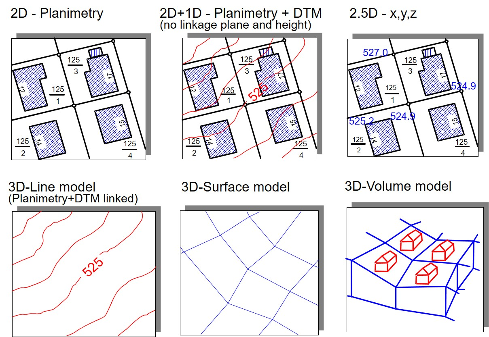

Up to this point, the geoobjects were assumed to be static and spatially two-dimensional. However, the geo-phenomena on which the geoobjects are based are almost always spatially three-dimensional and often temporally dynamic.

The height as a third spatial dimension is usually listed as a thematic attribute in GIS, this modeling is then called 2.5D. GIS offers a wealth of functions for working with terrain models. Further functions support, for example, the determination of terrain inclination and exposure, the derivation of flow paths, catchment areas and other terrain morphological parameters. Furthermore, the elevation data are used for pseudo-3D visualization. However, real 3D modeling and functions for determining volumes, volume averages or intersections are rarely found in GIS.

In order to consider the dynamics (time as a dimension) of a geoobject, two approaches can be roughly distinguished. The **snapshot** approach is based on the idea of a snapshot of all attribute values of a geoobject at a certain point in time. An obvious example is a population census, which often collects data on the population at large time intervals based on administrative units. Here, however, it can only be determined that a change (e.g. in the number of inhabitants) has occurred for a specific geoobject (e.g. a municipality), but not exactly when this change occurred. Since a snapshot is always taken for all geoobjects in order to save a new state, this approach also requires a lot of memory. On the other hand there is the **timestamp** approach. Here only the attributes of a geoobject for which a value has changed are considered. The new value is provided with the timestamp of the change. For example, measurement series or mobile objects can be displayed: For each change of location, the new position of the object (e.g. of a vehicle) is provided and saved with a time stamp. This type of modeling is more memory efficient and it is easy to determine when a value has changed. If, however, the states of value at a certain point in time are to be determined for all objects considered, more complex queries are necessary.

Both approaches are widespread in practice, but, still methods for temporal analysis, are only rudimentarily supported by today's GIS (Bernard, 2005, Broßeit et.al., 2014). In GIS, for example, the coupling with models for the simulation of time-variant geophenomena (wind flows, pollutant propagation, floods, traffic flows, noise pollution) is usually carried out via special file interfaces (e.g. NetCDF), which also enable the import of time-variant geodata into GIS. These time-variant geodata can then be animated in GIS, but not aggregated or analyzed for conspicuous temporal patterns.