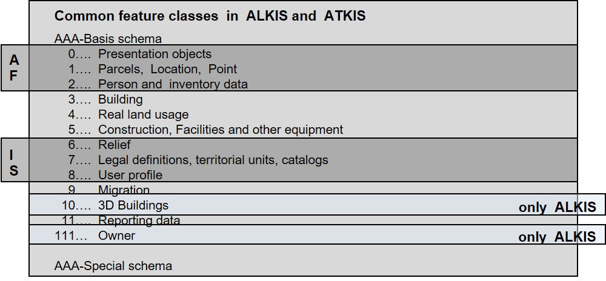

The different forms of object modeling will be illustrated below using various examples. We start here with examples from the field of authoratative surveying and geoinformation, in which the AAA project in Germany is currently operated by the AdV (Arbeitsgemeinschaft der Vermessungsverwaltungen des Bundes und der Länder). AAA combines AFIS, the Official Fixed Point Information System, ALKIS, the Official Real Estate Cadastre Information System, and ATKIS, the Official Topographical-Cartographic Information System. The AdV projects AFIS, ALKIS and ATKIS with their defined characteristics are described in a consistent form and based on standards in the GeoInfoDok (AdV, 2009) as a common application scheme and related to each other in a common reference model. This also provides for the collection and management of metadata and quality data in accordance with ISO standardization (see Bill, 2016, page 647 ff.).

!!! The basic data stock, including metadata, is managed by all surveying authorities of the federal states of the Federal Republic of Germany in AFIS, ALKIS and ATKIS on a national basis and made available to the user on a transnational basis. The basic data stock must be defined from a technical point of view and is marked in the AAA technical scheme as harmonized as possible. The AAA schema contains 7 object types that are defined exclusively in AFIS, 88 object types that are valid for ALKIS and ATKIS, 40 object types that are defined only in ALKIS, and 20 object types that are defined only in ATKIS (see figure).

