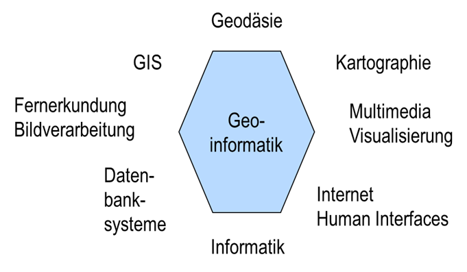

Die Geoinformatik als Wissenschaftsdisziplin ist eine so genannte „Bindestrich-Informatik“ wie die Bio-Informatik, Medizin-Informatik oder Umwelt-Informatik und baut auf Konzepten und Methoden der Informatik auf, ist jedoch aus den Anwendungsdisziplinen heraus initiiert und in diesen auch sehr stark verwurzelt. Insofern fand die Erforschung und Entwicklung raumbezogener Konzepte und Technologien etwa ab den 80er Jahren zunächst ohne nennenswerte eigene Beiträge der Informatik statt, z. B. in der Geographie, in der Geodäsie, der Photogrammetrie, der Kartographie, der Hydrologie und den Planungswissenschaften. Das Thema Raumbezug wird erst in den letzten Jahrzehnten zunehmend auch in der Informatik z. B. in der Datenbank- und Visualisierungsentwicklung, in der Robotik oder im Data Warehousing aufgegriffen.

