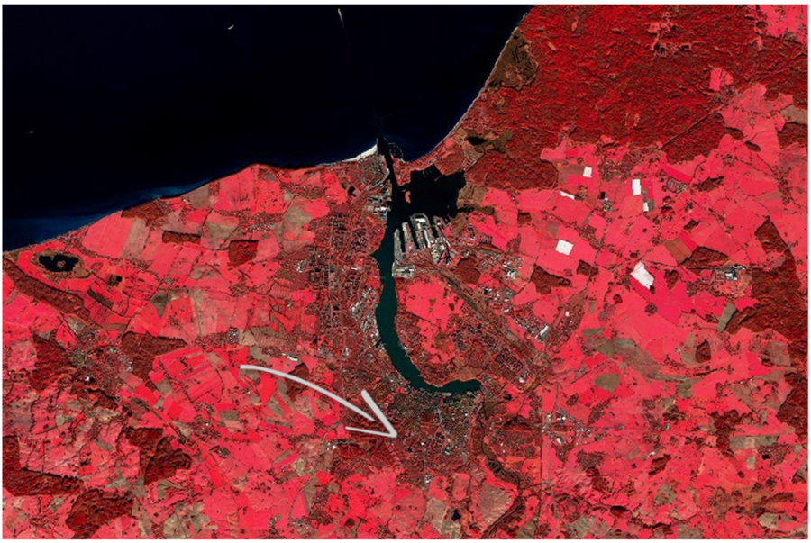

## Allgemeines 
Hinter „Senitel-2“ verbirgt sich nicht nur ein einzelner Satellit, sondern ein Satellitenpaar. Start: 22.06.15 (2A), 07.03.17 (2B). Sie umkreisen die Erde in einem polaren Orbit in einer Höhe von ca. 786 km. Die Überflugszeiten sind dabei ähnlich zu Landsat und SPOT-5. Dadurch sind die Datensätze vergleichbarer und lassen auch Zeitreihenanalysen zu.

*Künstlerische Darstellung von Senitnel-2. Rechts: Aufnahme aus dem Taunus (Hessen), jeweils in verschiedener Kombination (rot-grün-blau, RGB) verschiedener Bänder.*

Eckdaten Sentinel-2:

-	Optischer Sensor mit 13 Kanälen – verteilt im elektromagnetischen Spektrum vom sichtbaren Licht über das Nahe Infrarot bis zum Mittleren (Kurzwelligen) Infrarot, ca. 440-2200 nm
-	Bodenauflösung: 10-60 m pro Pixel
-	Hohe temporale Abdeckung (alle 5 Tage mit 2 Satelliten, 10 Tage für 1 Satellit)
- Die Schwadbreite ist mit 290 km größer als etwa die von Landsat 7 und Landsat 8 (185 km) oder SPOT (120 km). Die herunterladbaren Sentinel-2 Bilder (Tiles, Kacheln) haben allerdings immer eine Größe von 100 x 100 km.

! Zum Kennenlernen bietet sich der [Sentinel Playground](http://apps.sentinel-hub.com/sentinel-playground/?source=S2&lat=40.34366578968397&lng=-3.6512374877929688&zoom=11&preset=1_NATURAL_COL0R&layers=B04,B03,B02&maxcc=20&gain=1.0&gamma=1.0&time=2015-01-01|2018-01-17&atmFilter=&showDates=false) an.
   

*Rostock von oben... Sentinel-2 Color Infrarot (CIR) Falschfarbkomposit, RGB: 8-4-3. Der Pfeil markiert (ungefähr) die Hauptgebäude der Universität Rostock.*
  

*Globale Abdeckung mit Sentinel-2 als 100x100 km Kacheln.* 
  

## Räumliche Auflösung

Die räumliche Auflösung beschreibt vor allem die Pixelgröße bzw. den Pixelabstand (im Bild oder am Objekt). Es ist abhängig von der Art des Sensors. Fähigkeit, Größe des CCD-Arrays (charge-coupled device) und die Blickwinkel. Einige wichtige Begriffe in der Fernerkundung und ihre Bedeutung sind: FOV= field of view, deutsch: Blickfeld, definiert die Schwadbreite; IFOV=instantaneous field of view, definiert den Winkel der einzelnen Sensoren; GIFOV=Ground instantaneous field of view, ist das auf den Boden projizierte IFOV. Die GSD=ground sample distance (aus GIFOV, Detektorgröße), definiert schließlich die resultierende Pixelgröße. Die räumliche Bildauflösung ist neben dem Kontrast entscheidend für die Erkennung von Objekten.
  

Vergleich von Sentinel-2 und Luftbild: 
<iframe src="https://h5p.org/h5p/embed/239827" width="100%" height="100%" frameborder="0" allowfullscreen="allowfullscreen"></iframe>
  

!!!! __Aufgabe:__ Beispiele unterschiedliche räumliche Auflösungen in der Fernerkundung:
<iframe src="https://h5p.org/h5p/embed/173319" width="1644" height="542" frameborder="0" allowfullscreen="allowfullscreen"></iframe>
  
