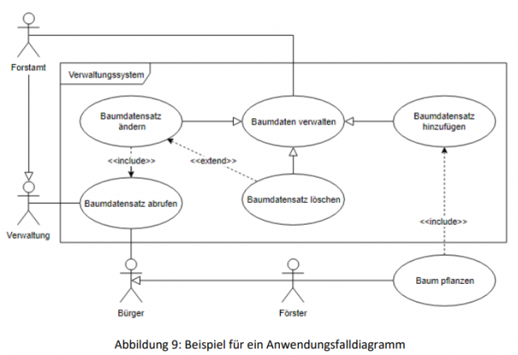

On this page you will find detailed help on various topics and tasks in geo-information systems.

[plugin:youtube](https://youtu.be/ZOTrDCiVma4)

Available tutorials you can find below: 

## Thematic map design

    

        

        This detailed manual explains how the results of an analysis can be visualised in a thematic map. We assume the existence of different data or analysis results and show how maps can be created using ArcMap (version 10.3). As datasets we use the charging stations (a point theme) and the results of the reachability analysis (a polygon theme) at municipal level from our case study on electro mobility. We combine those on a background map and illustrate what elements are part of a map and which elements are used. Also we explain what signatures or colour gradations can be used. The result - a combination of an overview and a detailed map - you can see here.
        

        
Download Tutorial [Thematic map design](OGE-Tutorial_Kartengestaltung-en.pdf?target=_blank)

    

    

<!-- 

    

        <h4>Tutorial Kartographie</h4>
        
Zur Erstellung anspruchsvoller kartographischer Produkte als Visualisierungsform der
            GIS-Analysen sind kartographische Grundkenntnisse essentiell. Dieses Skript stellt wesentliche Aspekte der
            thematischen Kartographie zusammen. Dabei werden Lehrmaterialien der Professur für Geodäsie und
            Geoinformatik in Präsenz- und Fernstudium genutzt.
            Dies ersetzt natürlich keine Le+hrveranstaltung Kartographie. Daher wird das Studium kartographischer
            Lehrbücher nahegelegt.

        
Download des Tutorials [Kartographie](OGE-Tutorial_Kartographie.pdf?target=_blank)

    

    

-->

--- 

## Modeling in UML and ER

    

        
This tutorial introduces you to the fundamentals of modeling and explains modeling using the Unified Modeling Language (UML) and the Entity Relationship Model (ER) as examples.

        
Download [Modeling in UML and ER](OGE-Tutorial_UML_Vorlesung-en.pdf?target=_blank)

    

    

    

        <h4>UML diagrams</h4>
        
In this unit you will apply the basics of the UML Class and Activity Diagram learned in the previous tutorial.

        
Download [UML diagrams](OGE-Tutorial_UML_uebung-en.pdf?target=_blank)

    

    

    

---

## Coordinates

    

        <h4><a href="https://xkcd.com/977/">Map projections</a> and coordinate systems</h4>
        
In this unit the problem of mapping the curved earth to a flat surface or other replacement figure shall be explained (map projections) and standard coordinate systems will be described.

        
Download [Coordinates](OGE-Tutorial_KNE_Koordinaten-en.pdf?target=_blank)

    

    

---

## Data formats

    

        

            This tutorial describes common data formats and explains how to use them when processing open geodata.
            In addition, tips and tricks are provided to facilitate the collective processing of the data.
        

        
Download Tutorial [Data formats](OGE-Tutorial_Dateiformate-en.pdf?target=_blank)

    

    

        “Person”: {
        "name": "John Smith",
        "isAlive": true,
        "age": 25,
        "address": {
        "cityStreet": "New York, 21 2nd Street",
        "postalCode": "10021-3100"
        },
        "children": [ ],
        "spouse": null
        }
    

---

## OGC-Web Services

    

        
This course unit describes common OGC Web Services and explains their use when processing open geodata. Tips and tricks for using OGC-WxS will be also covered.

        
Download Tutorial [OGC Web Services](OGE-Tutorial_OGC_WxS-en.pdf?target=_blank)

    

    

---

## Licenses

    

        
In this tutorial, common licenses for open data and software are described and their relevancce for the processing of open geodata is explained.

        
Download Tutorial [Licenses](OGE-Tutorial_Lizenzen-en.pdf?target=_blank)

    

    

---
 
 
