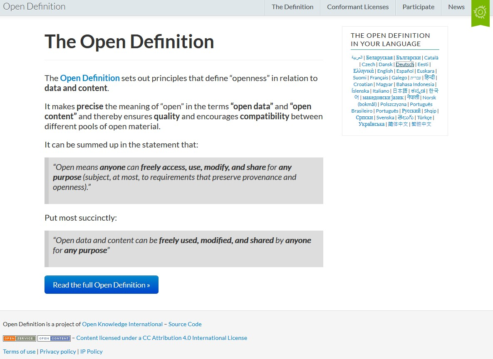
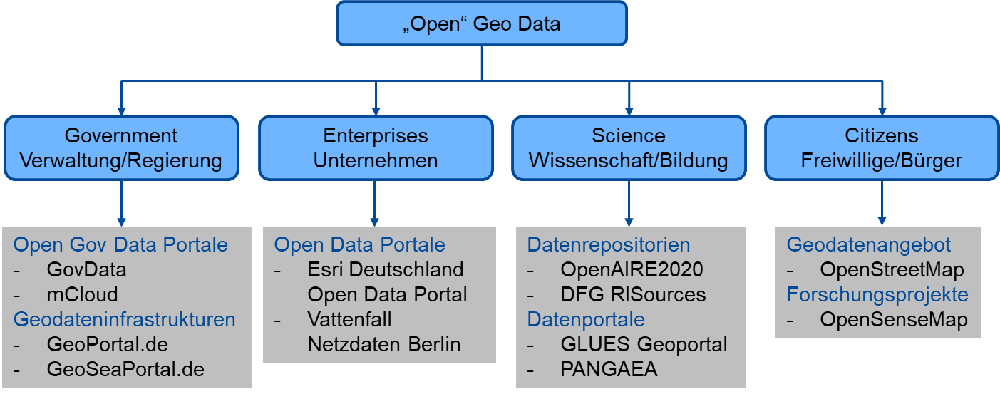

# Offene Daten

---

# The Open Definition

> Offene Daten sind Daten, die von jedem und zu jedem Zweck genutzt, verändert und weitergegeben werden können. <cite>[opendefinition.org](https://opendefinition.org/)</cite>

---

# Offene Geodaten

Offene Geodaten werden schon viel genutzt - sind vielerorts, trotz hoher Relevanz, in der praktischen Ausbildung zu selten Arbeitsgegendstand