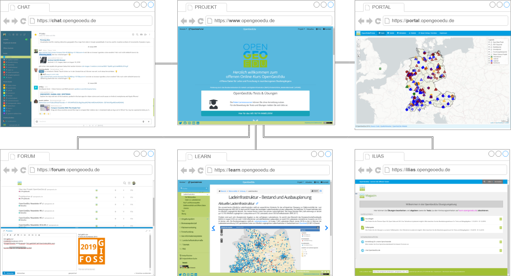
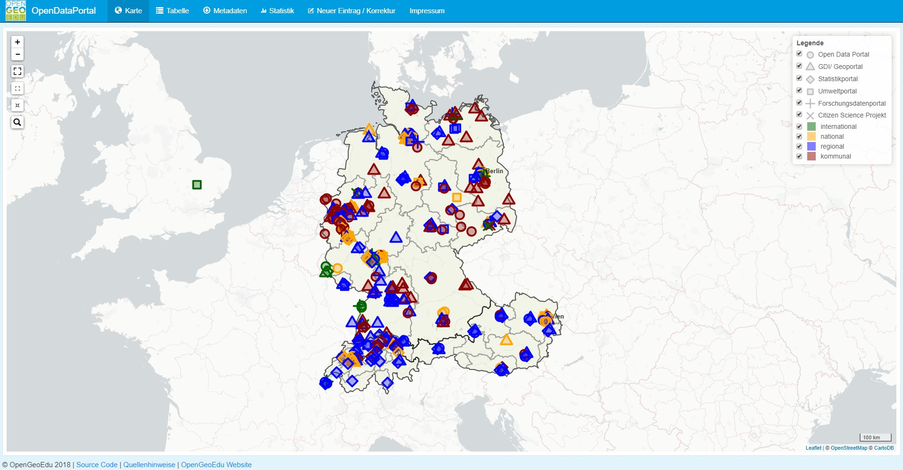
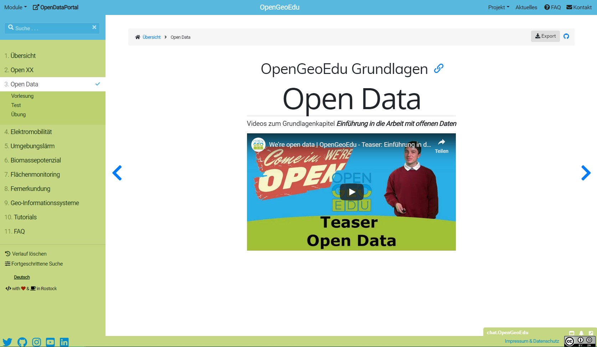
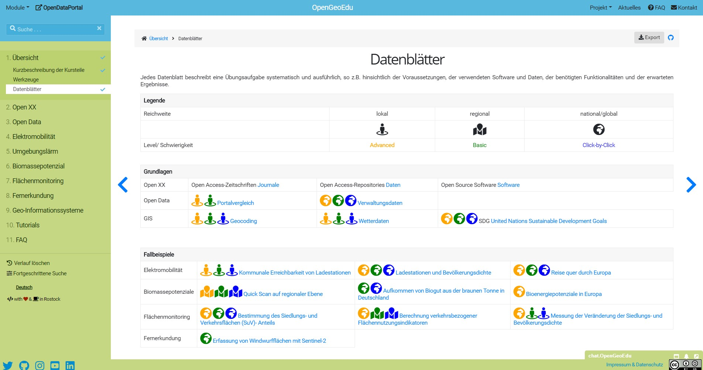
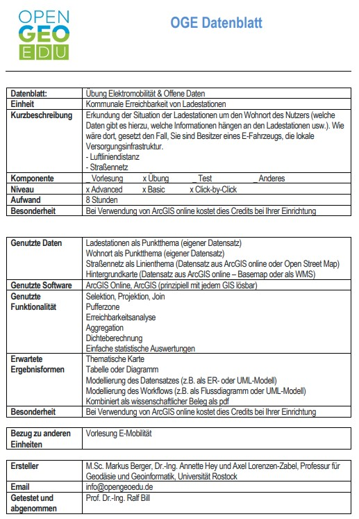
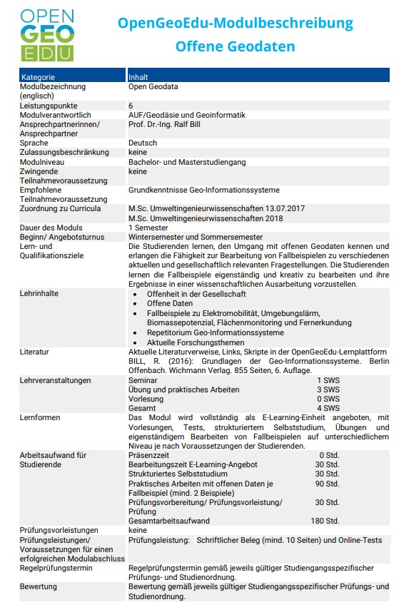
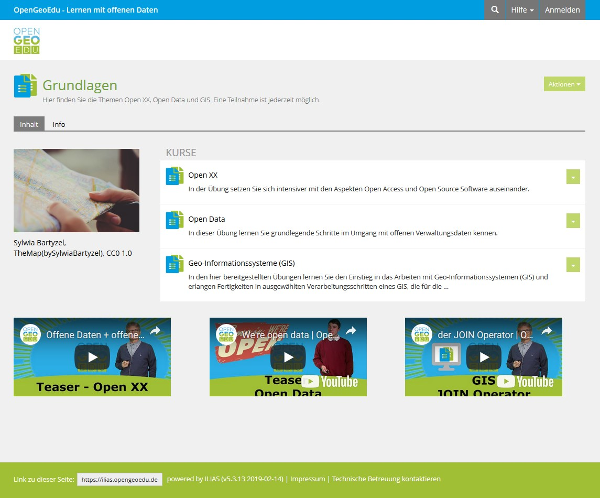

# Projekt

OpenGeoEdu soll die Nutzung von offenen Geodaten in raumbezogenen Studiengängen anhand von Best-Practice-Beispielen illustrieren und darauf aufbauend E-Learning-Angebote für die  Integration in einer Vielzahl von Studiengängen bereitstellen. Dies soll den offenen Datenschatz für Ausbildung und Wissenschaft heben und vielfältige Anwendungs- und Vernetzungsmöglichkeiten für Forschung und Lehre ermöglichen.

### Kennzahlen

  

    Projektlaufzeit   Juli 2017 - April 2020  
    

    

    Projektvolumen  	1,10 Mio. €
  

  
---

# Projektpartner

  

    

      
    

    

      
    

  

  

    

      
    

    

      
    

  

---

### Wie funktioniert das?
## Mit offenen Daten lernen?!

  

    

      
      Finde offene Daten!
    

    

      
      Lerne mit offenen Daten!
    

    

      
      Teste dein Wissen!
    

  

---

# Komponenten

[notes]
- Einsatz der Komponenten
[/notes]

---

#### PORTAL.opengeoedu.de

---

#### Vorlesung

---

#### LEARN.opengeoedu.de

---

---

#### Datenblatt zur Übung

<!-- 

  

      Jedes Datenblatt beschreibt eine Übungsaufgabe systematisch und ausführlich, 
      so z.B. hinsichtlich der Voraussetzungen, der verwendeten Software und Daten, 
      der benötigten Funktionalitäten und der erwarteten Ergebnisse.
  

  

    
  

 -->

---

# Modulbeschreibung

<!-- Konform zu Modulbeschreibungen in Bachelor- oder 
Masterstudiengängen finden Sie hier eine Modulbeschreibung zum offenen Online-Kurs OpengeoEdu. -->

<!-- 

  

      Konform zu Modulbeschreibungen in Bachelor- oder 
      Masterstudiengängen finden Sie hier eine Modulbeschreibung zum offenen Online-Kurs OpengeoEdu.
  

  

    
  

 -->

---

#### LEARN.opengeoedu.de

  

      Ausführliche Hilfestellungen zu verschiedenen Themen und Aufgaben in Geo-Informationssystemen  
  

  

    
  

---

#### ILIAS.opengeoedu.de

---

#### Kommunikation und Kollaboration

---

  

    Chat
  

    

    Forum
  

  

    Twitter
  

    

    IG
  

---
