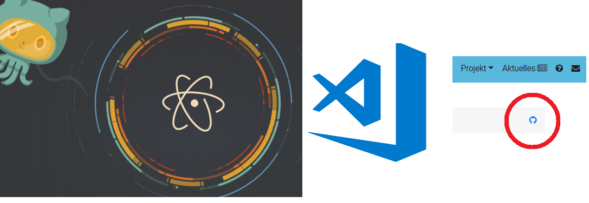

! Bitte beachten Sie die ausführliche Markdown Dokumentation auf https://learn.getgrav.org/content/markdown<br>
! Eine Markdown Übersicht hat heise hier auf einer Seite Zusammengefasst: https://www.heise.de/mac-and-i/downloads/65/1/1/6/7/1/0/3/Markdown-CheatSheet-Deutsch.pdf

## Markdown bearbeiten
Für die lokale Bearbeitung der OpenGeoEdu Inhalte können Sie [VS CODE](https://code.visualstudio.com/),
[atom.io](https://atom.io/) oder die Online-Editierfunktion von GitHub nutzen.


## Überschriften

Überschriften der Ebenen `h1` bis  `h6` werden durch die entsprechende Anzahl von `#` generiert.
```markdown
# h1 Heading
## h2 Heading
### h3 Heading
#### h4 Heading
```

wird zu:

# h1 Heading
## h2 Heading
### h3 Heading
#### h4 Heading

HTML:

```html
<h1>h1 Heading</h1>
<h2>h2 Heading</h2>
<h3>h3 Heading</h3>
<h4>h4 Heading</h4>
```

<br>

## Kommentare

Kommentare sind HTML kompatibel:

```html
<!--
This is a comment
-->
```
folgendes Kommentar ist **nicht** sichtbar:

<!--
This is a comment
-->

<br>

## Notices
In OGE GRAV werden ``!`` für die Farbboxen (Notices) genutzt

```
! verweis/link(Links und Verweise auf Literatur oder Webseiten)
!! Gedankenanstöße in anderer Farbe
!!! Definition
!!!! Fragen / Lernziele
!!!!! tba
!!!!!! tba
```

! Links und Verweise auf Literatur oder Webseiten

!! Gedankenanstöße in anderer Farbe

!!! Definition

!!!! Fragen / Lernziele

!!!!! tba

!!!!!! tba

<!--beschränkte Farbauswahl

<div class="p-3 mb-2 bg-primary text-white">.bg-primary</div>
<div class="p-3 mb-2 bg-secondary text-white">.bg-secondary</div>
<div class="p-3 mb-2 bg-success text-white">.bg-success</div>
<div class="p-3 mb-2 bg-warning text-dark">.bg-warning</div>
<div class="p-3 mb-2 bg-info text-white">.bg-info</div>
<div class="p-3 mb-2 bg-light text-dark">.bg-light</div>
<div class="p-3 mb-2 bg-dark text-white">.bg-dark</div>
<div class="p-3 mb-2 bg-white text-dark">.bg-white</div>
-->


<br>

### Zitat mit Autor:
Zur Angabe des Autors wird `<cite></cite>` am ende des Blockquote angefügt:
```markdown
> **Fusion Drive** combines a hard drive with a flash storage (solid-state drive) and presents it as a single logical volume with the space of both drives combined.
<cite>[Michael Kuster](https://example.com)</cite>
```

> **Fusion Drive** combines a hard drive with a flash storage (solid-state drive) and presents it as a single logical volume with the space of both drives combined. <cite>[Michael Kuster](https://example.com)</cite>

<br>


<!-- ## Horizontal Rules

The HTML `<hr>` element is for creating a "thematic break" between paragraph-level elements. In markdown, you can create a `<hr>` with any of the following:

* `___`: three consecutive underscores
* `---`: three consecutive dashes
* `***`: three consecutive asterisks

renders to:

___

---

***


<br>
<br>
<br>


## Body Copy

Body copy written as normal, plain text will be wrapped with `<p></p>` tags in the rendered HTML.

So this body copy:

```markdown
Lorem ipsum dolor sit amet, graecis denique ei vel, at duo primis mandamus. Et legere ocurreret pri, animal tacimates complectitur ad cum. Cu eum inermis inimicus efficiendi. Labore officiis his ex, soluta officiis concludaturque ei qui, vide sensibus vim ad.
```
renders to this HTML:

```html
<p>Lorem ipsum dolor sit amet, graecis denique ei vel, at duo primis mandamus. Et legere ocurreret pri, animal tacimates complectitur ad cum. Cu eum inermis inimicus efficiendi. Labore officiis his ex, soluta officiis concludaturque ei qui, vide sensibus vim ad.</p>
```

A **line break** can be done with 2 spaces followed by 1 return.


<br>
<br>
<br>
-->

## Inline HTML
HTML und Markdown funktionieren problemlos miteinander. So können Sie beispielsweise Klassen definiert werden:
```html
Paragraph in Markdown.

<div class="class">
</div>

Paragraph in Markdown.
```

### Markdown in HTML
Für die Verwendung von markdown in html-inline-Abschnitten muss folgender Wert gesetzt werden:
`markdown="1"`

valide Syntax:

```
<div class="container" markdown="1">
  
</div>
```

## Footnotes (bigfootjs)

```markdown
[^1]
```

<br>
## Listen

### Ungeordnet
Auflistung von dingen in unbestimmter Reihenfolge. Zur Auszeichnung einer ungeordneten Liste wird entweder ein `*` `-` oder ein `+` verwendet

```markdown
* valid bullet
- valid bullet
+ valid bullet
```

In diesem Beispiel mit Einrückungen für Unterpunkte

```markdown
+ Lorem ipsum dolor sit amet
+ Consectetur adipiscing elit
+ Integer molestie lorem at massa
+ Facilisis in pretium nisl aliquet
+ Nulla volutpat aliquam velit
  - Phasellus iaculis neque
  - Purus sodales ultricies
  - Vestibulum laoreet porttitor sem
  - Ac tristique libero volutpat at
+ Faucibus porta lacus fringilla vel
+ Aenean sit amet erat nunc
+ Eget porttitor lorem
```
Wird zu:

+ Lorem ipsum dolor sit amet
+ Consectetur adipiscing elit
+ Integer molestie lorem at massa
+ Facilisis in pretium nisl aliquet
+ Nulla volutpat aliquam velit
  - Phasellus iaculis neque
  - Purus sodales ultricies
  - Vestibulum laoreet porttitor sem
  - Ac tristique libero volutpat at
+ Faucibus porta lacus fringilla vel
+ Aenean sit amet erat nunc
+ Eget porttitor lorem

<!-- And this HTML

```html
<ul>
  <li>Lorem ipsum dolor sit amet</li>
  <li>Consectetur adipiscing elit</li>
  <li>Integer molestie lorem at massa</li>
  <li>Facilisis in pretium nisl aliquet</li>
  <li>Nulla volutpat aliquam velit
    <ul>
      <li>Phasellus iaculis neque</li>
      <li>Purus sodales ultricies</li>
      <li>Vestibulum laoreet porttitor sem</li>
      <li>Ac tristique libero volutpat at</li>
    </ul>
  </li>
  <li>Faucibus porta lacus fringilla vel</li>
  <li>Aenean sit amet erat nunc</li>
  <li>Eget porttitor lorem</li>
</ul>
```
-->
### Geordnete Liste

Eine Auflistung von Dingen in einer vorgegebenen Reihenfolge:
```markdown
1. Lorem ipsum dolor sit amet
1. Consectetur adipiscing elit
1. Integer molestie lorem at massa
1. Facilisis in pretium nisl aliquet
1. Nulla volutpat aliquam velit
1. Faucibus porta lacus fringilla vel
1. Aenean sit amet erat nunc
1. Eget porttitor lorem
```
wird zu:

1. Lorem ipsum dolor sit amet
2. Consectetur adipiscing elit
3. Integer molestie lorem at massa
4. Facilisis in pretium nisl aliquet
5. Nulla volutpat aliquam velit
6. Faucibus porta lacus fringilla vel
7. Aenean sit amet erat nunc
8. Eget porttitor lorem

<!--
And this HTML:

```html
<ol>
  <li>Lorem ipsum dolor sit amet</li>
  <li>Consectetur adipiscing elit</li>
  <li>Integer molestie lorem at massa</li>
  <li>Facilisis in pretium nisl aliquet</li>
  <li>Nulla volutpat aliquam velit</li>
  <li>Faucibus porta lacus fringilla vel</li>
  <li>Aenean sit amet erat nunc</li>
  <li>Eget porttitor lorem</li>
</ol>
```
-->

!!! **TIP**: Beachten Sie die `1.` für jede Zeile, Markdown numeriert die Zeilen dann automatisch:

<br>

## Tabellen
Tables are created by adding pipes as dividers between each cell, and by adding a line of dashes (also separated by bars) beneath the header. Note that the pipes do not need to be vertically aligned.


```markdown
| Option | Description |
| ------ | ----------- |
| data   | path to data files to supply the data that will be passed into templates. |
| engine | engine to be used for processing templates. Handlebars is the default. |
| ext    | extension to be used for dest files. |
```

Renders to:

| Option | Description |
| ------ | ----------- |
| data   | path to data files to supply the data that will be passed into templates. |
| engine | engine to be used for processing templates. Handlebars is the default. |
| ext    | extension to be used for dest files. |

And this HTML:

```html
<table>
  <thead>
    <tr>
      <th>Option</th>
      <th>Description</th>
    </tr>
  </thead>
  <tbody>
    <tr>
      <td>data</td>
      <td>path to data files to supply the data that will be passed into templates.</td>
    </tr>
    <tr>
      <td>engine</td>
      <td>engine to be used for processing templates. Handlebars is the default.</td>
    </tr>
    <tr>
      <td>ext</td>
      <td>extension to be used for dest files.</td>
    </tr>
  </tbody>
</table>
```

### Right aligned text

Adding a colon on the right side of the dashes below any heading will right align text for that column.

```markdown
| Option | Description |
| ------:| -----------:|
| data   | path to data files to supply the data that will be passed into templates. |
| engine | engine to be used for processing templates. Handlebars is the default. |
| ext    | extension to be used for dest files. |
```

| Option | Description |
| ------:| -----------:|
| data   | path to data files to supply the data that will be passed into templates. |
| engine | engine to be used for processing templates. Handlebars is the default. |
| ext    | extension to be used for dest files. |


<br>
<br>
<br>


## Emphasis

### Bold
For emphasizing a snippet of text with a heavier font-weight.

The following snippet of text is **rendered as bold text**.

```markdown
**rendered as bold text**
```
renders to:

**rendered as bold text**

and this HTML

```html
<strong>rendered as bold text</strong>
```

### Italics
For emphasizing a snippet of text with italics.

The following snippet of text is _rendered as italicized text_.

```markdown
_rendered as italicized text_
```

renders to:

_rendered as italicized text_

and this HTML:

```html
<em>rendered as italicized text</em>
```


### strikethrough
In GFM (GitHub flavored Markdown) you can do strikethroughs.

```markdown
~~Strike through this text.~~
```
Which renders to:

~~Strike through this text.~~

HTML:

```html
<del>Strike through this text.</del>
```

<br>
<br>
<br>


## Blockquotes
For quoting blocks of content from another source within your document.

Add `>` before any text you want to quote.

```markdown
> **Fusion Drive** combines a hard drive with a flash storage (solid-state drive) and presents it as a single logical volume with the space of both drives combined.
```

Renders to:

> **Fusion Drive** combines a hard drive with a flash storage (solid-state drive) and presents it as a single logical volume with the space of both drives combined.

and this HTML:

```html
<blockquote>
  <p><strong>Fusion Drive</strong> combines a hard drive with a flash storage (solid-state drive) and presents it as a single logical volume with the space of both drives combined.</p>
</blockquote>
```

<br>
<br>

## Code

### Inline code
Wrap inline snippets of code with `` ` ``.

```markdown
In this example, `<section></section>` should be wrapped as **code**.
```

Renders to:

In this example, `<section></section>` should be wrapped with **code**.

HTML:

```html
<p>In this example, <code>&lt;section&gt;&lt;/section&gt;</code> should be wrapped with <strong>code</strong>.</p>
```

### Indented code

Or indent several lines of code by at least four spaces, as in:

<pre>
  // Some comments
  line 1 of code
  line 2 of code
  line 3 of code
</pre>

Renders to:

    // Some comments
    line 1 of code
    line 2 of code
    line 3 of code

HTML:

```html
<pre>
  <code>
    // Some comments
    line 1 of code
    line 2 of code
    line 3 of code
  </code>
</pre>
```


### Block code "fences"

Use "fences"  ```` ``` ```` to block in multiple lines of code.

<pre>
``` markup
Sample text here...
```
</pre>


```
Sample text here...
```

HTML:

```html
<pre>
  <code>Sample text here...</code>
</pre>
```

### Syntax highlighting

GFM, or "GitHub Flavored Markdown" also supports syntax highlighting. To activate it, simply add the file extension of the language you want to use directly after the first code "fence", ` ```js `, and syntax highlighting will automatically be applied in the rendered HTML. For example, to apply syntax highlighting to JavaScript code:

<pre>
```js
grunt.initConfig({
  assemble: {
    options: {
      assets: 'docs/assets',
      data: 'src/data/*.{json,yml}',
      helpers: 'src/custom-helpers.js',
      partials: ['src/partials/**/*.{hbs,md}']
    },
    pages: {
      options: {
        layout: 'default.hbs'
      },
      files: {
        './': ['src/templates/pages/index.hbs']
      }
    }
  }
};
```
</pre>

Renders to:

```js
grunt.initConfig({
  assemble: {
    options: {
      assets: 'docs/assets',
      data: 'src/data/*.{json,yml}',
      helpers: 'src/custom-helpers.js',
      partials: ['src/partials/**/*.{hbs,md}']
    },
    pages: {
      options: {
        layout: 'default.hbs'
      },
      files: {
        './': ['src/templates/pages/index.hbs']
      }
    }
  }
};
```
<!--
!!! For syntax highlighting to work, the [Highlight plugin](https://github.com/getgrav/grav-plugin-highlight) needs to be installed and enabled. It in turn utilizes a jquery plugin, so jquery needs to be loaded in your theme too.
-->
<br>
<br>
<br>


## Links

### Basic link

```markdown
[Assemble](http://assemble.io)
```

Renders to (hover over the link, there is no tooltip):

[Assemble](http://assemble.io)

HTML:

```html
<a href="http://assemble.io">Assemble</a>
```


### Add a title

```markdown
[Upstage](https://github.com/upstage/ "Visit Upstage!")
```

Renders to (hover over the link, there should be a tooltip):

[Upstage](https://github.com/upstage/ "Visit Upstage!")

HTML:

```html
<a href="https://github.com/upstage/" title="Visit Upstage!">Upstage</a>
```

### Named Anchors

Named anchors enable you to jump to the specified anchor point on the same page. For example, each of these chapters:

```markdown
# Table of Contents
  * [Chapter 1](#chapter-1)
  * [Chapter 2](#chapter-2)
  * [Chapter 3](#chapter-3)
```
will jump to these sections:

```markdown
## Chapter 1 <a id="chapter-1"></a>
Content for chapter one.

## Chapter 2 <a id="chapter-2"></a>
Content for chapter one.

## Chapter 3 <a id="chapter-3"></a>
Content for chapter one.
```
**NOTE** that specific placement of the anchor tag seems to be arbitrary. They are placed inline here since it seems to be unobtrusive, and it works.


<br>
<br>
<br>


## Images

```markdown

```


Images have a similar syntax to links but include a preceding exclamation point.

```markdown

```


or
```markdown

```


Like links, Images also have a footnote style syntax

```markdown
![Alt text][id]
```
![Alt text][id]

With a reference later in the document defining the URL location:

[id]: http://octodex.github.com/images/dojocat.jpg  "The Dojocat"


    [id]: http://octodex.github.com/images/dojocat.jpg  "The Dojocat"

---

## Code Markierung
Einfaches Einrücken mit 4 Leerzeichen am Zeilenanfang
oder mit ```

    ```
     codezeile1
     codezeile2
     ```
wird zu html

    <pre>
        <code>
          codezeile1
          codezeile2
        </code>
    </pre>

## Shortcodes
The core plugin contains a few simple shortcodes that can be used as basic examples:

#### Underline
Underline a section of text

```
This is some [u]bb style underline[/u] and not much else
```

#### Font Size
Set the size of some text to a specific pixel size

```
This is [size=30]bigger text[/size]
```

#### Alignment
Left align the text between this shortcode

```
[left]This text is left aligned[/left]
```

Center a selection of text between this shortcode

```
[center]This text is centered[/center]
```

Right align the text between this shortcode

```
[right]This text is right aligned[/right]
```


#### Div

Allows you to wrap markdown in an HTML `div` tag that supports both `id` and `classes` attributes

```
[div class="text-center"]

 This text is **centered** aligned

[/div]
```

or

```
[div class="table table-striped"]
| header 1 | header 2 |
|----------|----------|
| A 1      | B 1      |
| A 2      | B 2      |
| A 3      | B 3      |
[/div]
```


#### Span

Allows you to wrap markdown in an HTML `span` tag that supports both `id` and `classes` attributes

```
[span class="text-center"]
This text is **centered** aligned
[/span]
```


#### Columns

Take advantage of powerful CSS columns support by using this shortcode

```
[columns]
### Headline

Lorem ipsum dolor sit amet, consectetur adipisicing elit, sed do eiusmod
tempor incididunt ut labore et dolore magna aliqua. Ut enim ad minim veniam,
quis nostrud exercitation ullamco laboris nisi ut aliquip ex ea commodo
consequat.

Duis aute irure dolor in reprehenderit in voluptate velit esse
cillum dolore eu fugiat nulla pariatur. Excepteur sint occaecat cupidatat non
proident, sunt in culpa qui officia deserunt mollit anim id est laborum.

Lorem ipsum dolor sit amet, consectetur adipisicing elit, sed do eiusmod
tempor incididunt ut labore et dolore magna aliqua. Ut enim ad minim veniam,
quis nostrud exercitation ullamco laboris nisi ut aliquip ex ea commodo
consequat.
[/columns]
```

Defaults to 2 columns.  You can also explicitly set the number of `columns`, `width`, `gap`, and `rule` styling for the column divider:

```
[columns count=3 width=200px gap=30px rule="1px dotted #930"]
### Headline

Lorem ipsum dolor sit amet, consectetur adipisicing elit, sed do eiusmod
tempor incididunt ut labore et dolore magna aliqua. Ut enim ad minim veniam,
quis nostrud exercitation ullamco laboris nisi ut aliquip ex ea commodo
consequat.

Duis aute irure dolor in reprehenderit in voluptate velit esse
cillum dolore eu fugiat nulla pariatur. Excepteur sint occaecat cupidatat non
proident, sunt in culpa qui officia deserunt mollit anim id est laborum.

Lorem ipsum dolor sit amet, consectetur adipisicing elit, sed do eiusmod
tempor incididunt ut labore et dolore magna aliqua. Ut enim ad minim veniam,
quis nostrud exercitation ullamco laboris nisi ut aliquip ex ea commodo
consequat.
[/columns]
```

#### Raw

Do not process the shortcodes between these raw shortcode tags

```
[raw]This is some [u]bb style underline[/u] and not much else[/raw]
```

#### Safe-Email

Encode an email address so that it's not so easily 'scrapable' by nefarious scripts.  This one has a couple of options: `autolink` toggle to turn the email into a link, and an `icon` option that lets you pick a font-awesome icon to prefix the email.  Both settings are optional.

```
Safe-Email Address: [safe-email autolink="true" icon="envelope-o"]user@domain.com[/safe-email]
```

#### Section

The **section** shortcode is a powerful way to encompass some text in your markdown page with a `[section][/section]` tag and then this is cached by Grav so it can be accessed later.  For example you could have a page with a variety of sections described in it that let you create many **chunks** of data. These are then added to Twig as an array of shortcode objects.  An example of this would be the following markdown:

```
[section name="author"]


### Johnny Appleseed
Johnny Appleseed was an American pioneer nurseryman who introduced apple trees to large parts of Pennsylvania, Ontario, Ohio, Indiana, and Illinois, as well as the northern counties of present-day West Virginia. He became an American legend while still alive, due to his kind, generous ways, his leadership in conservation, and the symbolic importance he attributed to apples.
[/section]

[section name="quote"]
> Some are born great, some achieve greatness, and some have greatness thrust upon them.
  Read more at http://www.brainyquote.com/quotes/topics/topic_great.html#tdqt3strtEYBCH43.99
> <cite>William Shakespeare</cite>

Regular **Markdown** content that will be output as `page.content`
[/section]
```

This we be removed from the page content and made available in Twig variables so you could insert these into custom HTML structures, for example:

```
<div id="author">{{ shortcode.section.author }}</div>

<div id="article">
    <div class="left">
        {{ page.content }}
    </div>
    <div class="right">
        {{ shortcode.section.quote }}
    </div>
</div>
```

#### Sections from other pages

You can even retrieve a section from another page utilizing the shortcodes as they are stored in the page's `contentMeta` with this syntax:

```
<div id="author">{{ page.find('/my/custom/page').contentMeta.shortcodeMeta.shortcode.section.author }}</div>
```

#### Notice

A useful shortcode that performs a similar job to the [markdown-notices](https://github.com/getgrav/grav-plugin-markdown-notices) plugins, allows you to easily create simple notice blocks as seen on http://learn.getgrav.org and http://getgrav.org.  To use simply use the following syntax:

```
[notice]
Your **Markdown** text that will appear in the notice
[/notice]
```

You can also specifically choose from `note`, `info`, `warning`, `tip` types which provide unique color options:

```
[notice=warning]
Danger Will Robinson! Danger, Will Robinson!
[/notice]
```

#### FontAwesome

[FontAwesome](https://fortawesome.github.io/Font-Awesome/) is a powerful library of font-based icons.  This shortcode makes it simple to add fontawesome icons to your page content without using HTML.

[fa=cog /] Simplest Format

[fa=fa-cog /] Format using `fa-` prefix

[fa icon=fa-camera-retro /] Explicit format

[fa icon=fa-camera-retro extras=fa-4x /] Explicit format with extras - [See FontAwesome Examples](https://fortawesome.github.io/Font-Awesome/examples/)

[fa icon=fa-circle-o-notch extras=fa-spin,fa-3x,fa-fw,margin-bottom /] The full monty! - [See FontAwesome Examples](https://fortawesome.github.io/Font-Awesome/examples/)

#### Anwendung der Shortcodes für die Reichweitenlegende und Level der Übung (s. [Datenblätter](/uebersicht/datenblatt))
##### A B C lokal
```
[color=orange] [fa=map-marked-alt][/color] [color=green] [fa=map-marked-alt][/color] [color=blue] [fa=map-marked-alt][/color]
```

##### A B C regional
```
[color=orange] [fa=map-marked][/color] [color=green] [fa=map-marked][/color] [color=blue] [fa=map-marked][/color]
```

##### A B C national
```
[color=orange] [fa=fa-map][/color] [color=green] [fa=fa-map][/color] [color=blue] [fa=fa-map][/color]
```
